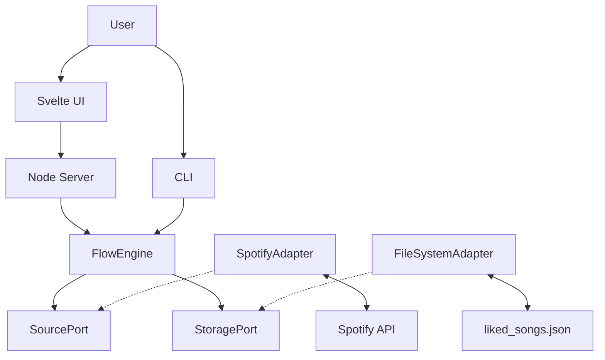

# System Architecture

This document outlines the architecture of Spotify Flow after the v2 refactoring and UI migration.

## 1. High-Level Overview

The system is now split into three main components:
1.  **Core Logic (Spotify Flow):** Domain logic, ports, and adapters.
2.  **Server:** A Node.js server that exposes the flow via API.
3.  **UI:** A Svelte-based frontend for user interaction.



## 2. Directory Structure

```
src/
├── spotify-flow/           # Core Domain Logic
│   ├── core/               # Pure domain logic (no external deps)
│   │   ├── types.ts        # Track, Artist, Album, FlowOptions
│   │   ├── ports.ts        # SourcePort, StoragePort interfaces
│   │   ├── engine.ts       # FlowEngine orchestrator
│   │   └── errors.ts       # Typed error classes
│   ├── adapters/
│   │   ├── spotify/        # SourcePort implementation
│   │   └── filesystem/     # StoragePort implementation
│   ├── config/
│   │   └── schema.ts       # Zod config validation
│   └── cli/
│       └── index.ts        # CLI Entry point
├── server/                 # Backend Server
│   └── index.ts            # Express-like server (http module)
└── ui/                     # Frontend (Svelte + Vite)
    ├── src/
    │   ├── lib/
    │   │   ├── components/ # Svelte components
    │   │   ├── stores/     # State management
    │   │   └── api.ts      # API client
    │   └── App.svelte      # Main application
    └── vite.config.ts      # Build config
```

## 3. Core Concepts

### FlowEngine
The orchestrator. It knows nothing about Spotify or files—only about `SourcePort` and `StoragePort`.

### Server
A lightweight HTTP server that:
- Serves the static UI files.
- Exposes `/api/spotify/run` to trigger the flow.
- Proxies requests to the `FlowEngine`.

### UI (Svelte)
A reactive frontend built with Svelte 5, Vite 6, and Tailwind 4.
- **State Management:** Svelte stores (`tracks`, `filter`, `status`).
- **Components:** Modular components (`TrackCard`, `Controls`, `MetricCard`).
- **Styling:** Glassmorphism design using Tailwind utilities.

## 4. Data Flow (UI)

```
1. User clicks "Fetch from Spotify"
2. UI calls POST /api/spotify/run
3. Server instantiates FlowEngine
4. FlowEngine fetches tracks and saves to liked_songs.json
5. Server responds with success
6. UI calls GET /outputs/spotify/liked_songs.json
7. UI hydrates stores and renders grid
```

## 5. Testing Strategy

```
tests/
├── unit/
│   └── engine.test.ts      # Mock adapters, test orchestration
└── integration/
    └── filesystem.test.ts  # Real filesystem operations
```

## 6. Error Handling

Typed errors are thrown from adapters and caught by the CLI or Server:

- `SpotifyAuthError`: Authentication failed.
- `SpotifyRateLimitError`: Rate limited, retry needed.
- `StorageError`: File system operations failed.
