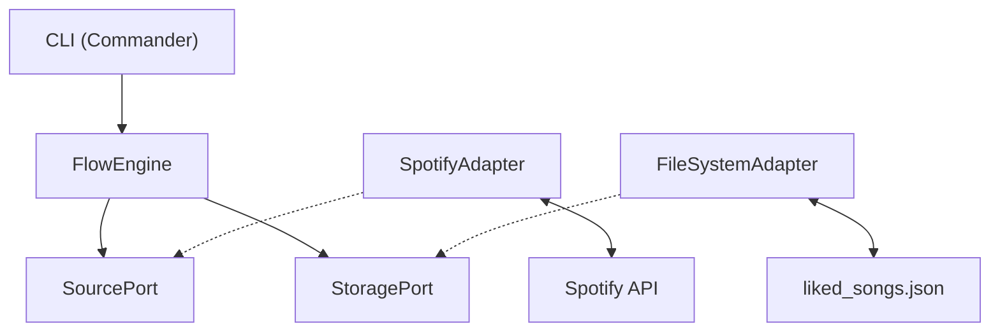

# System Architecture

This document outlines the architecture of Spotify Flow after the v2 refactoring.

## 1. High-Level Overview



## 2. Directory Structure

```
src/spotify-flow/
├── core/                    # Pure domain logic (no external deps)
│   ├── types.ts            # Track, Artist, Album, FlowOptions
│   ├── ports.ts            # SourcePort, StoragePort interfaces
│   ├── engine.ts           # FlowEngine orchestrator
│   └── errors.ts           # Typed error classes
├── adapters/
│   ├── spotify/            # SourcePort implementation
│   │   ├── index.ts        # SpotifyAdapter
│   │   └── types.ts        # Spotify API response types
│   └── filesystem/         # StoragePort implementation
│       └── index.ts        # FileSystemAdapter
├── config/
│   └── schema.ts           # Zod config validation
├── cli/
│   └── index.ts            # Entry point (Commander.js)
└── ui/                     # Web interface (future scope)
```

## 3. Core Concepts

### FlowEngine
The orchestrator. It knows nothing about Spotify or files—only about `SourcePort` and `StoragePort`.

```typescript
class FlowEngine {
  constructor(source: SourcePort, storage: StoragePort) {}
  async run(options: FlowOptions): Promise<void>
}
```

### Ports (Interfaces)
```typescript
interface SourcePort {
  fetchTracks(limit?: number): Promise<Track[]>;
}

interface StoragePort {
  saveTracks(tracks: Track[]): Promise<void>;
  loadTracks(): Promise<Track[] | null>;
}
```

### Adapters (Implementations)
- **SpotifyAdapter**: Handles OAuth, pagination, rate-limiting.
- **FileSystemAdapter**: Reads/writes `liked_songs.json`.

## 4. Data Flow

```
1. CLI parses args (--limit)
2. Config loaded and validated (Zod)
3. Adapters instantiated
4. FlowEngine.run() called
5. SpotifyAdapter.fetchTracks() -> Track[]
6. FileSystemAdapter.saveTracks(Track[])
7. Done
```

## 5. Testing Strategy

```
tests/
├── unit/
│   └── engine.test.ts      # Mock adapters, test orchestration
└── integration/
    └── filesystem.test.ts  # Real filesystem operations
```

## 6. Error Handling

Typed errors are thrown from adapters and caught by the CLI:

- `SpotifyAuthError`: Authentication failed.
- `SpotifyRateLimitError`: Rate limited, retry needed.
- `StorageError`: File system operations failed.
