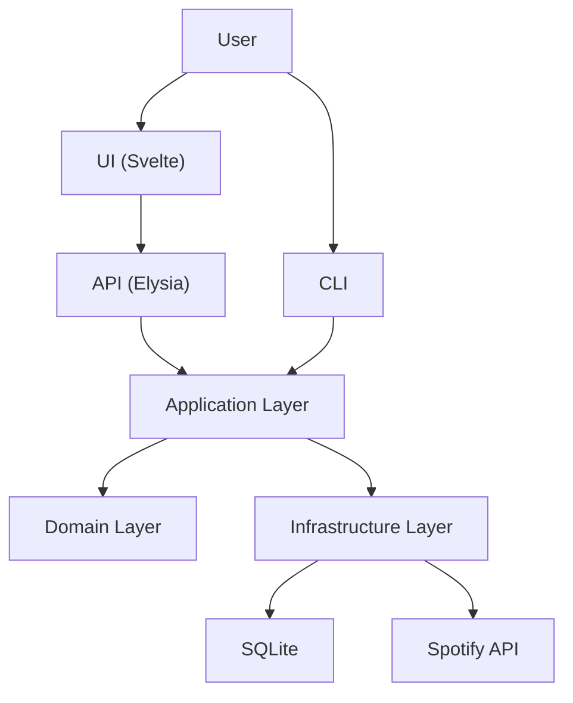

# System Architecture

This document provides a high-level overview of the Flow Sample architecture.

## Overview



## Layered Architecture

| Layer | Location | Responsibility |
|-------|----------|----------------|
| **API** | `src/api/` | HTTP routes, validation, serialization |
| **Application** | `src/application/` | Use cases, orchestration |
| **Domain** | `src/domain/` | Entities, ports, business rules |
| **Infrastructure** | `src/infrastructure/` | External integrations (DB, APIs) |

## Tech Stack

| Component | Technology |
|-----------|------------|
| **UI** | Svelte 5, Vite 7, Tailwind CSS 4 |
| **Server** | Elysia (Node.js adapter) |
| **Database** | SQLite (better-sqlite3) |
| **Validation** | Zod, TypeBox |
| **Logging** | Pino |

## Directory Structure

```
flow-sample/
├── ui/                         # Frontend (Svelte)
├── src/
│   ├── api/                    # HTTP Layer (Elysia)
│   │   ├── app.ts              # Server entry point
│   │   ├── spotify.routes.ts   # Spotify endpoints
│   │   └── config.ts           # Zod config loader
│   ├── application/            # Use Cases
│   │   └── spotify.usecase.ts
│   ├── domain/                 # Pure Business Logic
│   │   ├── flows/spotify/      # Spotify entities
│   │   └── shared/             # Ports, errors
│   ├── infrastructure/         # External Integrations
│   │   ├── adapters/           # API clients
│   │   ├── persistence/        # SQLite
│   │   └── repositories/       # Repository implementations
│   └── cli/                    # CLI entry point
├── data/                       # SQLite database
├── outputs/                    # Generated data
└── docs/
    └── architecture/           # This documentation
```

## Detailed Documentation

- [UI Architecture](./ui.md)
- [Server Architecture](./server.md)
- [Backend Architecture](./backend.md)
