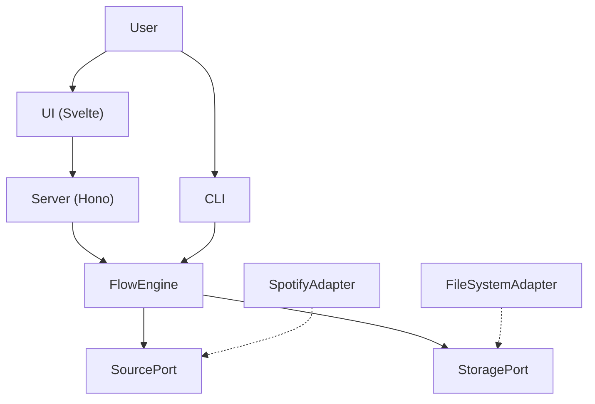

# System Architecture

This document provides a high-level overview of the Flow Sample architecture.

## Overview



## Components

| Component | Tech Stack | Purpose |
|-----------|------------|---------|
| **UI** | Svelte 5, Vite, Tailwind 4 | User interface |
| **Server** | Hono, Node.js | API + Static serving |
| **Backend** | TypeScript, Hexagonal Architecture | Business logic |

## Directory Structure

```
flow-sample/
├── ui/                     # Frontend (Svelte)
├── src/
│   ├── server/             # HTTP Server (Hono)
│   └── spotify-flow/       # Core Domain Logic
│       ├── core/           # Ports, Engine, Types
│       ├── adapters/       # Spotify, FileSystem
│       ├── config/         # Zod schemas
│       └── cli/            # CLI entry point
├── outputs/                # Generated data
└── docs/
    └── architecture/       # This documentation
```

## Detailed Documentation

- [UI Architecture](./ui.md)
- [Server Architecture](./server.md)
- [Backend Architecture](./backend.md)
