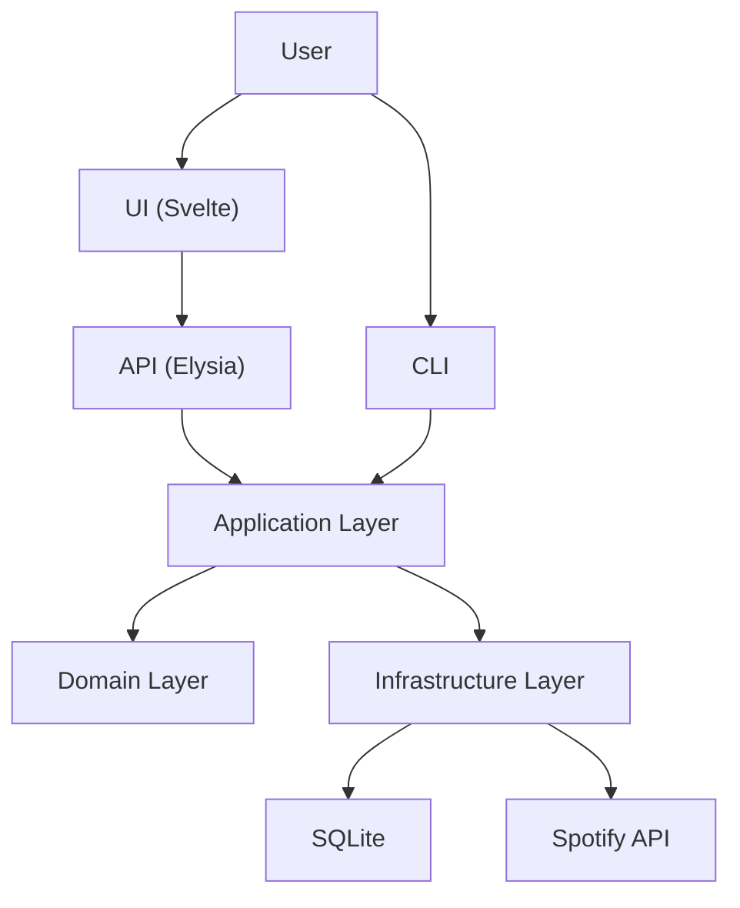

# System Architecture

This document provides a high-level overview of the Flow Sample architecture.

## Overview



## Layered Architecture

| Location | Responsibility |
|----------|----------------|
| **API** | `packages/backend/src/api/` | HTTP routes, validation, serialization |
| **Application** | `packages/backend/src/application/` | Use cases, orchestration |
| **Domain** | `packages/backend/src/domain/` | Entities, ports, business rules |
| **Infrastructure** | `packages/backend/src/infrastructure/` | External integrations (DB, APIs) |

## Tech Stack

| Component | Technology |
|-----------|------------|
| **UI** | Svelte 5, Vite 7, Tailwind CSS 4, Chart.js |
| **Server** | Elysia (Node.js adapter) |
| **Database** | SQLite (better-sqlite3) |
| **Validation** | Zod, TypeBox |
| **Logging** | Pino |

## Directory Structure

```
flow-sample/
├── packages/
│   ├── backend/
│   │   ├── src/
│   │   │   ├── api/                    # HTTP Layer (Elysia)
│   │   │   ├── application/            # Use Cases
│   │   │   ├── domain/                 # Pure Business Logic
│   │   │   └── infrastructure/         # External Integrations
│   ├── ui/                             # Frontend (Svelte)
│   └── shared/                         # Shared Types
├── data/                       # SQLite database
├── outputs/                    # Generated data
└── docs/
    └── architecture/           # This documentation
```

## Detailed Documentation

- [UI Architecture](./ui.md)
- [Server Architecture](./server.md)
- [Backend Architecture](./backend.md)
