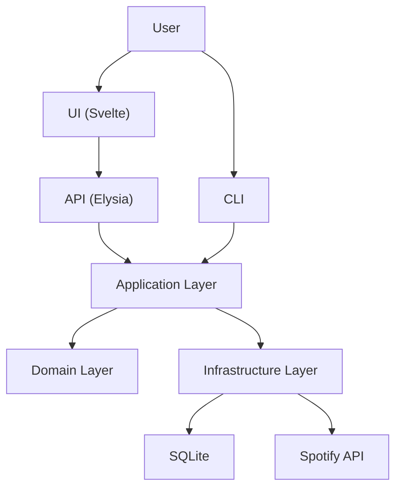

# System Architecture

This document provides a high-level overview of the Flow Sample architecture.

## Overview


```mermaid
graph TD
    User["User"] --> UI["UI (Svelte)"]
    User --> CLI["CLI"]
    
    UI --> API["API (Elysia)"]
    API --> UseCase["Application Layer"]
    CLI --> UseCase
    
    UseCase --> Domain["Domain Layer"]
    UseCase --> Infra["Infrastructure Layer"]
    
    Infra --> SQLite["SQLite"]
    Infra --> SpotifyAPI["Spotify API"]
```

## Layered Architecture (per Flow)

Each independent flow package (`packages/flows/*`) follows a layered architecture pattern:

| Layer | Location | Responsibility |
| ----- | -------- | -------------- |
| **API** | `src/api/` | HTTP routes (Elysia), validation |
| **Domain** | `src/domain/` | Pure business logic, equations, entities |
| **Infrastructure** | `src/infrastructure/` | External API clients, repositories |

## Tech Stack

| Component | Technology |
| --------- | ---------- |
| **UI** | Svelte 5, Vite 7, Tailwind CSS 4, Chart.js |
| **Server** | Elysia (Node.js adapter) |
| **Database** | SQLite (better-sqlite3) |
| **Validation** | Zod, TypeBox |
| **Logging** | Pino |

## Directory Structure

```text
flow-sample/
├── packages/
│   ├── core/                           # Shared infrastructure (DB connection, Logger, LLM integration)
│   ├── backend/                        # API server host (Elysia app init)
│   ├── flows/                          # Independent bounded contexts
│   │   ├── shared/                     # Shared types and DTOs
│   │   ├── chat/                       # Chat Flow (Dynamic LLM provider integration)
│   │   ├── spotify/                    # Spotify Flow (API + DB + Domain)
│   │   ├── lyrics/                     # Lyrics Flow (API + DB + Domain)
│   │   └── trading/                    # Trading Flow (API + SSE + Domain)
│   └── ui/                             # Frontend application (Svelte 5)
├── data/                               # SQLite database volume
├── outputs/                            # Generated data
└── docs/
    └── architecture/                   # This documentation
```

## Detailed Documentation

- [UI Architecture](./ui.md)
- [Server Architecture](./server.md)
- [Backend Architecture](./backend.md)
