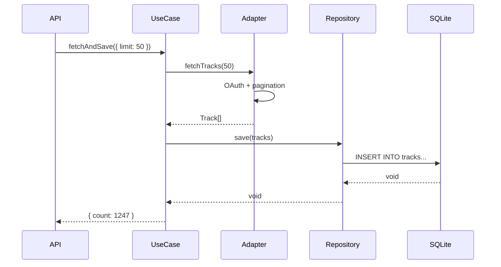

# Backend Architecture

## Overview

The backend follows **Layered Architecture** with clear separation of concerns.

## Layers

```
┌─────────────────────────────────────────┐
│  API Layer (src/api/)                   │
│  - HTTP routes, validation              │
├─────────────────────────────────────────┤
│  Application Layer (src/application/)   │
│  - Use cases, orchestration             │
├─────────────────────────────────────────┤
│  Domain Layer (src/domain/)             │
│  - Entities, ports, business rules      │
├─────────────────────────────────────────┤
│  Infrastructure Layer (src/infra/)      │
│  - Adapters, repositories, persistence  │
└─────────────────────────────────────────┘
```

## Directory Structure

```
src/
├── domain/                     # Pure domain logic (no external deps)
│   ├── flows/spotify/
│   │   ├── entities.ts         # Track, Artist, Album
│   │   └── repository.ts       # TrackRepository interface
│   └── shared/
│       ├── ports.ts            # SourcePort, StoragePort
│       └── errors.ts           # Domain errors
│
├── infrastructure/             # External integrations
│   ├── adapters/
│   │   └── spotify-api/        # Spotify Web API client
│   ├── persistence/
│   │   └── sqlite/             # Database connection + schema
│   └── repositories/
│       └── sqlite-track.repository.ts
│
├── application/                # Use cases
│   ├── spotify.usecase.ts      # SpotifyUseCase
│   └── logger.ts               # Pino logger
│
└── api/                        # HTTP layer
    ├── app.ts                  # Elysia server
    └── spotify.routes.ts       # Route definitions
```

## Domain Layer

### Entities

```typescript
// domain/flows/spotify/entities.ts
interface Track {
  id: string;
  title: string;
  artists: Artist[];
  album: Album;
  addedAt: string;
  durationMs: number;
  popularity?: number;
}
```

### Ports (Interfaces)

```typescript
// domain/shared/ports.ts
interface SourcePort {
  fetchTracks(limit?: number): Promise<Track[]>;
}

interface StoragePort {
  saveTracks(tracks: Track[]): Promise<void>;
  loadTracks(): Promise<Track[] | null>;
}
```

## Infrastructure Layer

### SQLite Persistence

```typescript
// infrastructure/persistence/sqlite/database.ts
db.exec(`
  CREATE TABLE IF NOT EXISTS tracks (...);
  CREATE TABLE IF NOT EXISTS artists (...);
  CREATE TABLE IF NOT EXISTS track_artists (...);
`);
```

### Repository Implementation

```typescript
// infrastructure/repositories/sqlite-track.repository.ts
class SQLiteTrackRepository implements TrackRepository {
  async save(tracks: Track[]): Promise<void> { ... }
  async findAll(): Promise<Track[]> { ... }
  async count(): Promise<number> { ... }
}
```

## Application Layer

### Use Cases

```typescript
// application/spotify.usecase.ts
class SpotifyUseCase {
  constructor(
    private source: SourcePort,
    private repository: TrackRepository
  ) {}

  async fetchAndSave(options: { limit?: number }): Promise<{ count: number }> {
    const tracks = await this.source.fetchTracks(options.limit);
    await this.repository.save(tracks);
    return { count: tracks.length };
  }

  async getTracks(): Promise<Track[]> {
    return this.repository.findAll();
  }
}
```

## Error Handling

| Error | When Thrown |
|-------|-------------|
| `SpotifyAuthError` | OAuth token invalid/expired |
| `SpotifyRateLimitError` | Rate limited (429) |
| `StorageError` | Database operations failed |

## Data Flow



## CLI Usage

```bash
# Run with default limit (20 pages = ~1000 tracks)
npm start

# Run with custom limit
npm start -- --limit 50
```
