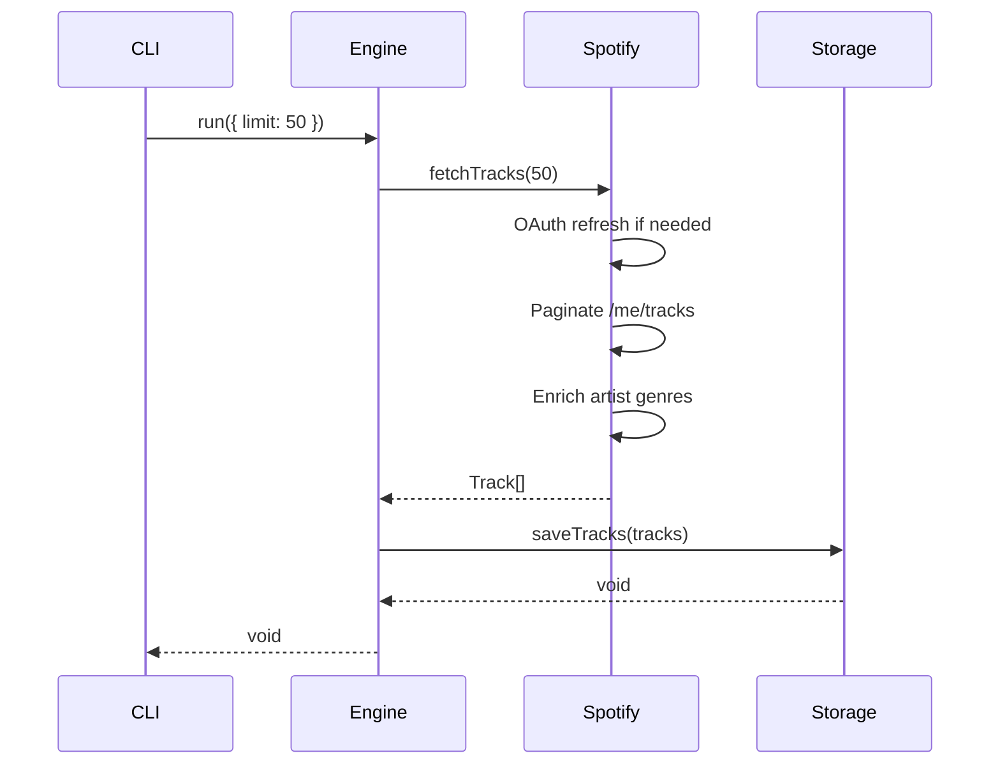

# Backend Architecture

## Overview

The backend follows **Hexagonal Architecture** (Ports & Adapters), ensuring the core business logic is decoupled from external dependencies.

## Tech Stack

| Technology | Purpose |
|------------|---------|
| **TypeScript** | Type safety |
| **Zod** | Config validation |
| **Pino** | Structured logging |
| **Axios** | HTTP client (Spotify API) |
| **Commander** | CLI parsing |

## Directory Structure

```
src/spotify-flow/
├── core/                   # Pure domain logic
│   ├── types.ts            # Track, Artist, Album, FlowOptions
│   ├── ports.ts            # SourcePort, StoragePort interfaces
│   ├── engine.ts           # FlowEngine orchestrator
│   ├── errors.ts           # Typed error classes
│   └── logger.ts           # Pino logger setup
├── adapters/
│   ├── spotify/            # SourcePort implementation
│   │   ├── index.ts        # SpotifyAdapter
│   │   └── types.ts        # Spotify API response types
│   └── filesystem/         # StoragePort implementation
│       └── index.ts        # FileSystemAdapter
├── config/
│   └── schema.ts           # Zod config validation
└── cli/
    └── index.ts            # Commander CLI entry point
```

## Core Concepts

### Ports (Interfaces)

```typescript
// ports.ts
interface SourcePort {
  fetchTracks(limit?: number): Promise<Track[]>;
}

interface StoragePort {
  saveTracks(tracks: Track[]): Promise<void>;
  loadTracks(): Promise<Track[] | null>;
}
```

### FlowEngine

The orchestrator that knows nothing about Spotify or files—only about ports.

```typescript
class FlowEngine {
  constructor(
    private source: SourcePort,
    private storage: StoragePort
  ) {}

  async run(options: FlowOptions): Promise<void> {
    const tracks = await this.source.fetchTracks(options.limit);
    await this.storage.saveTracks(tracks);
  }
}
```

### Adapters

**SpotifyAdapter** (implements `SourcePort`):
- OAuth token management
- Pagination handling
- Rate limit retry (with `SpotifyRateLimitError`)
- Artist enrichment (genres)

**FileSystemAdapter** (implements `StoragePort`):
- Read/write `liked_songs.json`
- Automatic directory creation

## Error Handling

Typed errors for specific failure modes:

| Error | When Thrown |
|-------|-------------|
| `SpotifyAuthError` | OAuth token invalid/expired |
| `SpotifyRateLimitError` | Rate limited (429), includes `retryAfterSeconds` |
| `StorageError` | File system operations failed |

## Data Flow



## Configuration

Loaded from `.env` and validated with Zod:

```typescript
const configSchema = z.object({
  spotify: z.object({
    clientId: z.string(),
    clientSecret: z.string(),
    refreshToken: z.string(),
    pageLimit: z.number().default(50),
  }),
  paths: z.object({
    output: z.string().default('./outputs/spotify'),
  }),
  app: z.object({
    host: z.string().default('127.0.0.1'),
    port: z.number().default(4173),
  }),
});
```

## CLI Usage

```bash
# Run with default limit
npm start

# Run with custom limit
npm start -- --limit 100
```
