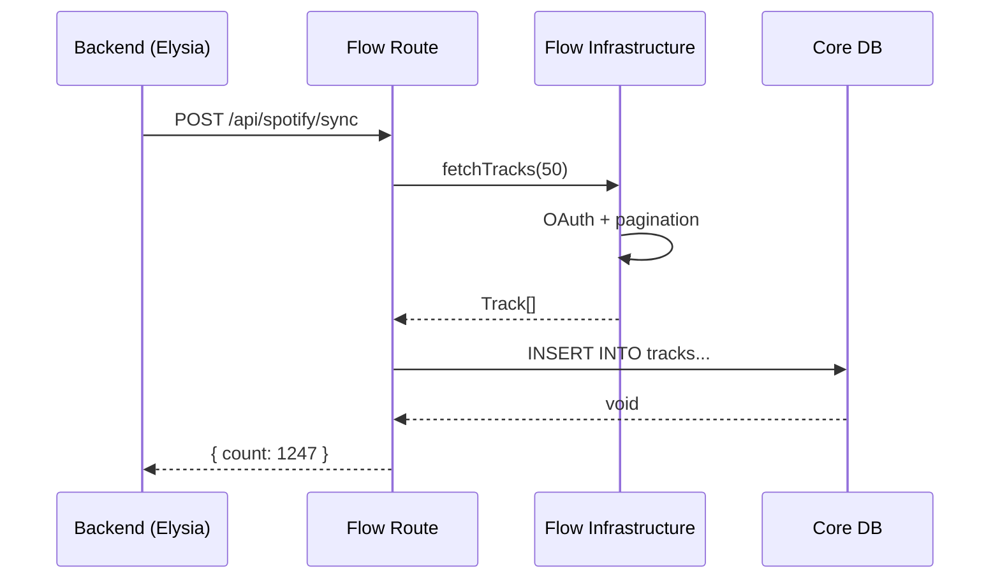

# Backend Architecture

For the cross-package map and refactor lanes, see
[System Map and Refactor Boundaries](./system-map.md).

## Overview

The backend has been refactored from a monolithic layered architecture into isolated **Bounded Contexts (Flows)**. Each flow is distributed as its own workspace package under `packages/flows/*`.

The central `packages/backend` workspace now acts strictly as an **Application Host**: it initializes the Elysia server, sets up global middleware (CORS, static files), and mounts the independent flow routes.

`packages/music` is a neutral in-process persistence package shared by Spotify and
Lyrics. It owns `music.db`, the track/artist/genre schema, FTS, and the track repository;
it is not a flow or separately deployed service.

## Bounded Contexts (Flows)

Each flow encapsulates its own Domain, Infrastructure, and API layers. They are isolated from one another and share only core infrastructure and types.

```text
packages/
├── shared/             # @flows/shared — shared types & DTOs (Track, Artist, …)
├── core/               # @flows/core — logger, SimpleCache, LLMClient, createDatabase()
└── flows/
    ├── spotify/        # Spotify Sync & Search Flow
    ├── lyrics/         # LrcLib Lyrics Fetcher Flow
    ├── trading/        # Binance real-time Trading & AI Advisor Flow
    ├── chat/           # Multi-provider LLM Chat Flow
    └── canvas/         # Generic text analysis canvas
```

### Layout per Flow (current state)

All five flows now follow the same high-level package shape: a `domain/` layer
for pure concepts, ports, and typed errors, plus a `backend/` layer for Elysia
routes, repositories, services, databases, and adapters. The remaining refactor
work is about tightening boundaries inside that shape, not introducing it.

```text
flow-package/
├── src/
│   ├── domain/             # Pure logic, ports, typed errors
│   └── backend/            # Elysia routes, repositories, DB, services, adapters
```

## Shared Infrastructure

To avoid duplicating database connections and logging setup, flows depend on the
`@flows/core` package. The database is created via a factory (not a global singleton):

```typescript
// packages/core/src/db/index.ts
import Database from 'better-sqlite3';
export function createDatabase(filename: string) {
  return new Database(filename);
}
```

The shared `music.db` connection is created by `@flows/music`. Spotify owns its token and
provider artist-cache repositories; Lyrics owns lyrics and interpretation repositories.
All use the same compatible SQLite file without importing sibling flow internals.

## LLM Provider Architecture

The `@flows/core/llm` module provides a unified interface for multiple LLM providers.

```text
@flows/core/src/llm/
├── client.ts              # Direct/rotation client and structured output metadata
├── types.ts               # Shared types (LLMMessage, ModelInfo, ModelTier, etc.)
├── index.ts               # Barrel: re-exports + createLLMClient() factory
└── providers/
    ├── base-provider.ts    # Abstract BaseLLMProvider
    ├── openai-compatible.ts # OpenAICompatibleProvider (shared base for groq/openrouter/cerebras/mistral)
    ├── gemini/             # Google Gemini (paid, @google/genai SDK)
    ├── groq/               # GroqCloud (free, OpenAI-compatible)
    ├── openrouter/         # OpenRouter dynamic free-model router
    ├── cerebras/           # Cerebras (free, 1M tokens/day)
    └── mistral/            # Mistral La Plateforme (free experiment tier)
```

Each provider has:

- `models.ts` — Static catalog with `{ id, name, tier, pricing, contextWindow }`
- `*-provider.ts` — Extends `BaseLLMProvider`, implements `generate()`, `listModels()`, etc.

**Model tiers:** `very_high` (frontier), `high` (near-frontier), `medium` (generalist), `low` (fast/light).

**Two client modes:**

```typescript
// Direct: use specific provider
const client = new LLMClient('groq');

// Rotation: provider defaults with fallback on provider errors
const client = LLMClient.createRotation();
```

Configure via `.env`: `LLM_PROVIDER=rotation` or `LLM_PROVIDER=groq`. `LLM_MODEL`
overrides the model only in direct mode. Rotation uses each provider's catalog default
because model identifiers are not portable across providers.

## Data Flow (Example: Spotify Sync)


```mermaid
sequenceDiagram
    participant API as Backend (Elysia)
    participant Route as Flow Route
    participant Adapter as Flow Infrastructure
    participant SQLite as Core DB

    API->>Route: POST /api/spotify/sync
    Route->>Adapter: fetchTracks(50)
    Adapter->>Adapter: OAuth + pagination
    Adapter-->>Route: Track[]
    Route->>SQLite: INSERT INTO tracks...
    SQLite-->>Route: void
    Route-->>API: { count: 1247 }
```

## Error Handling

Each flow defines its own domain errors extending the standard JS `Error` class, which are then caught and transformed by Elysia's error handlers in the `api/` layer.

### Chat HTTP And SSE Boundary

`@flows/chat` is import-safe: importing the package exports factories and classes but does
not open `chat.db` or construct a provider client. `createChatRoutes()` is the composition
root that creates `ChatDatabase` and `ChatService`; tests inject a `ChatApplication` fake
and exercise the Elysia route through `.handle()`.

Conversation absence maps to a stable `404`. Invalid domain requests map to `400`, and
provider failures map to a sanitized `503`. Once an SSE response has started, failures
are sent as a typed `error` event with the same sanitized message. Detailed provider
errors remain in server logs.

Chat response DTOs and stream-event discriminants live in `@flows/shared`. The service
yields typed stream events; only the route serializes them as SSE frames. This keeps HTTP
formatting out of application orchestration and lets the UI consume Eden responses
without boundary casts.

## CLI Usage

The backend application host provides a CLI for local development:

```bash
# Run the complete API server (mounts all flows)
pnpm run --filter @flows/backend dev
```
