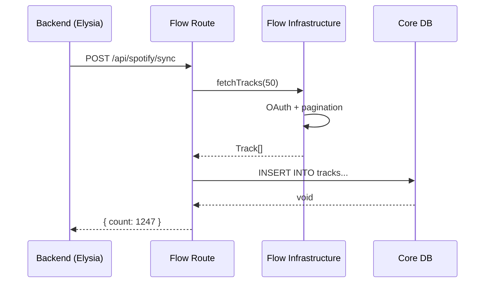

# Backend Architecture

## Overview

The backend has been refactored from a monolithic layered architecture into isolated **Bounded Contexts (Flows)**. Each flow is distributed as its own workspace package under `packages/flows/*`.

The central `packages/backend` workspace now acts strictly as an **Application Host**: it initializes the Elysia server, sets up global middleware (CORS, static files), and mounts the independent flow routes.

## Bounded Contexts (Flows)

Each flow encapsulates its own Domain, Infrastructure, and API layers. They are isolated from one another and share only core infrastructure and types.

```text
packages/
├── shared/             # @flows/shared — shared types & DTOs (Track, Artist, …)
├── core/               # @flows/core — logger, SimpleCache, LLMClient, createDatabase()
└── flows/
    ├── spotify/        # Spotify Sync & Search Flow
    ├── lyrics/         # LrcLib Lyrics Fetcher Flow
    ├── trading/        # Binance real-time Trading & AI Advisor Flow
    └── chat/           # Multi-provider LLM Chat Flow
```

### Layout per Flow (current state)

The flows are **not yet uniform** — two patterns coexist today. Unifying them is a
B2 goal (see [refactor-proposals/B1-ordering.md](../refactor-proposals/B1-ordering.md)
and GitHub issue #18); B1 keeps them in place.

```text
# Hexagonal (spotify, trading): a domain/ layer split from infrastructure
flow-package/
├── src/
│   ├── domain/             # Pure math, entities, ports, typed errors
│   └── backend/            # Elysia routes, repositories, DB, services
│       └── adapter/        # External API clients (trading: src/adapters/binance/)

# Flat (lyrics, chat): routes + data access, no domain/ layer yet
flow-package/
├── src/
│   └── backend/            # routes.ts, repository.ts / database.ts, adapter/
```

## Shared Infrastructure

To avoid duplicating database connections and logging setup, flows depend on the
`@flows/core` package. The database is created via a factory (not a global singleton):

```typescript
// packages/core/src/db/index.ts
import Database from 'better-sqlite3';
export function createDatabase(filename: string) {
  return new Database(filename);
}
```

> **Note:** the shared `music.db` (used by spotify + lyrics) is currently created
> inside `@flows/spotify` and exported as `musicDb`. Relocating it to neutral
> ownership is a B2 item — see issue #18.

## LLM Provider Architecture

The `@flows/core/llm` module provides a unified interface for multiple LLM providers.

```text
@flows/core/src/llm/
├── client.ts              # LLMClient class (Direct + Rotation modes, generateObject)
├── types.ts               # Shared types (LLMMessage, ModelInfo, ModelTier, etc.)
├── index.ts               # Barrel: re-exports + createLLMClient() factory
└── providers/
    ├── base-provider.ts    # Abstract BaseLLMProvider
    ├── openai-compatible.ts # OpenAICompatibleProvider (shared base for groq/openrouter/cerebras/mistral)
    ├── gemini/             # Google Gemini (paid, @google/genai SDK)
    ├── groq/               # GroqCloud (free, OpenAI-compatible)
    ├── openrouter/         # OpenRouter aggregator (free :free models)
    ├── cerebras/           # Cerebras (free, 1M tokens/day)
    └── mistral/            # Mistral La Plateforme (free experiment tier)
```

Each provider has:

- `models.ts` — Static catalog with `{ id, name, tier, pricing, contextWindow }`
- `*-provider.ts` — Extends `BaseLLMProvider`, implements `generate()`, `listModels()`, etc.

**Model tiers:** `very_high` (frontier), `high` (near-frontier), `medium` (generalist), `low` (fast/light).

**Two client modes:**

```typescript
// Direct: use specific provider
const client = new LLMClient('groq');

// Rotation: round-robin across free providers (fallback on 429)
const client = LLMClient.createRotation();
```

Configure via `.env`: `LLM_PROVIDER=rotation` or `LLM_PROVIDER=groq`.

## Data Flow (Example: Spotify Sync)


```mermaid
sequenceDiagram
    participant API as Backend (Elysia)
    participant Route as Flow Route
    participant Adapter as Flow Infrastructure
    participant SQLite as Core DB

    API->>Route: POST /api/spotify/sync
    Route->>Adapter: fetchTracks(50)
    Adapter->>Adapter: OAuth + pagination
    Adapter-->>Route: Track[]
    Route->>SQLite: INSERT INTO tracks...
    SQLite-->>Route: void
    Route-->>API: { count: 1247 }
```

## Error Handling

Each flow defines its own domain errors extending the standard JS `Error` class, which are then caught and transformed by Elysia's error handlers in the `api/` layer.

## CLI Usage

The backend application host provides a CLI for local development:

```bash
# Run the complete API server (mounts all flows)
pnpm run --filter @flows/backend dev
```
