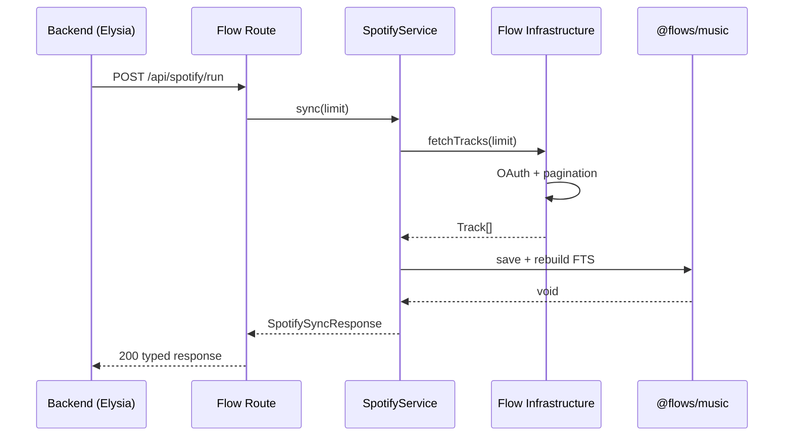

# Backend Architecture

For the cross-package map and refactor lanes, see
[System Map and Refactor Boundaries](./system-map.md).

## Overview

The backend has been refactored from a monolithic layered architecture into isolated **Bounded Contexts (Flows)**. Each flow is distributed as its own workspace package under `packages/flows/*`.

The central `packages/backend` workspace now acts strictly as an **Application Host**: it initializes the Elysia server, sets up global middleware (CORS, static files), mounts the independent flow routes, and keeps browser SPA fallback separate from JSON API 404s.

`packages/music` is a neutral in-process persistence package shared by Spotify and
Lyrics. It owns `music.db`, the track/artist/genre schema, FTS, and the track repository;
it is not a flow or separately deployed service.

`packages/analysis` is a neutral in-process analysis package shared by Canvas and
Lyrics. It owns deterministic tokenization, prompt-safe AST preparation, annotation-ID
filtering, and generic `canvas.db` persistence. Flow-specific prompts and orchestration
remain in their flow packages.

`packages/board` is an application-composition package for named boards. It owns
`boards.db`, default/active-board invariants, repository-backed mutations, and the
`/api/boards` route factory. It is mounted by the host but is not a sixth registered
flow or a separately deployed service.

## Bounded Contexts (Flows)

Each flow encapsulates its own Domain, Infrastructure, and API layers. They are isolated
from one another and consume only declared neutral packages and shared contracts.

```text
packages/
├── shared/             # @flows/shared — shared types & DTOs (Track, Artist, …)
├── core/               # @flows/core — logger, SimpleCache, LLMClient, createDatabase()
├── analysis/           # @flows/analysis — neutral text-analysis capabilities
├── music/              # @flows/music — neutral music persistence
├── board/              # @flows/board — named-board persistence and API
└── flows/
    ├── spotify/        # Spotify Sync & Search Flow
    ├── lyrics/         # LrcLib Lyrics Fetcher Flow
    ├── trading/        # Binance real-time Trading & AI Advisor Flow
    ├── chat/           # Multi-provider LLM Chat Flow
    └── canvas/         # Generic text analysis canvas
```

### Layout per Flow (current state)

All five flows now follow the same high-level package shape: a `domain/` layer
for pure concepts, ports, and typed errors, plus a `backend/` layer for Elysia
routes, repositories, services, databases, and adapters. Every flow places material
orchestration behind injectable application services. The remaining architectural work
is product work rather than another flow-boundary migration. Backend workspaces extend
the root `tsconfig.backend.json`; package configs own only output/declaration differences.

```text
flow-package/
├── src/
│   ├── domain/             # Pure logic, ports, typed errors
│   └── backend/            # Elysia routes, repositories, DB, services, adapters
```

## Shared Infrastructure

To avoid duplicating database connections and logging setup, flows depend on the
`@flows/core` package. The database is created via a factory (not a global singleton):

```typescript
// packages/core/src/db/index.ts
import Database from 'better-sqlite3';
export function createDatabase(filename: string) {
  return new Database(filename);
}
```

`@flows/music` exports named create/initialize functions and repositories that require an
explicit handle. The backend host creates one `music.db` connection and injects it into
Spotify and Lyrics. Spotify owns its token and provider artist-cache repositories;
Lyrics owns lyrics and interpretation repositories. They share the neutral schema
without importing sibling flow internals.

The separate `boards.db` connection is created by `@flows/board`. Its service guarantees
one protected default board, repairs missing/deleted active selection to that default,
and validates names, layout versions, item sizes, and duplicate flow IDs before the
repository writes. SQL and row hydration remain in `backend/repository.ts`; Elysia routes
only validate and map HTTP errors.

`@flows/analysis` exposes an injectable repository over `canvas.db`. The host creates one
repository and shares it between Canvas and Lyrics; both retain their own prompts,
schemas, and application services.

Trading exposes a `TradingPersistence` port and a SQLite implementation. Its route
dependency factory creates the handle and injects the same adapter into stream, analyst,
mentor, and market services. No package opens SQLite or mutates schema during import.
The compiled-runtime check imports every affected public entrypoint from an empty
temporary directory and fails if any filesystem entry appears.

## LLM Provider Architecture

The `@flows/core/llm` module provides a unified interface for multiple LLM providers.

```text
@flows/core/src/llm/
├── client.ts              # Direct/rotation client and structured output metadata
├── types.ts               # Shared types (LLMMessage, ModelInfo, ModelTier, etc.)
├── index.ts               # Barrel: re-exports + createLLMClient() factory
└── providers/
    ├── base-provider.ts    # Abstract BaseLLMProvider
    ├── openai-compatible.ts # OpenAICompatibleProvider (shared base for groq/openrouter/cerebras/mistral)
    ├── gemini/             # Google Gemini (paid, @google/genai SDK)
    ├── groq/               # GroqCloud (free, OpenAI-compatible)
    ├── openrouter/         # OpenRouter dynamic free-model router
    ├── cerebras/           # Cerebras (free, 1M tokens/day)
    └── mistral/            # Mistral La Plateforme (free experiment tier)
```

Each provider has:

- `models.ts` — Static catalog with `{ id, name, tier, pricing, contextWindow }`
- `*-provider.ts` — Extends `BaseLLMProvider`, implements `generate()`, `listModels()`, etc.

**Model tiers:** `very_high` (frontier), `high` (near-frontier), `medium` (generalist), `low` (fast/light).

**Two client modes:**

```typescript
// Direct: use specific provider
const client = new LLMClient('groq');

// Rotation: provider defaults with fallback on provider errors
const client = LLMClient.createRotation();
```

Configure via `.env`: `LLM_PROVIDER=rotation` or `LLM_PROVIDER=groq`. `LLM_MODEL`
overrides the model only in direct mode. Rotation uses each provider's catalog default
because model identifiers are not portable across providers.

## Data Flow (Example: Spotify Sync)


```mermaid
sequenceDiagram
    participant API as Backend (Elysia)
    participant Route as Flow Route
    participant Service as SpotifyService
    participant Adapter as Flow Infrastructure
    participant Music as @flows/music

    API->>Route: POST /api/spotify/run
    Route->>Service: sync(limit)
    Service->>Adapter: fetchTracks(limit)
    Adapter->>Adapter: OAuth + pagination
    Adapter-->>Service: Track[]
    Service->>Music: save + rebuild FTS
    Music-->>Service: void
    Service-->>Route: SpotifySyncResponse
    Route-->>API: 200 typed response
```

## Error Handling

Each flow defines its own domain errors extending the standard JS `Error` class, which are then caught and transformed by Elysia's error handlers in the `api/` layer.

### Spotify And Lyrics HTTP Boundaries

`SpotifyService` owns OAuth URL/state, synchronization, cache invalidation, library
queries, and aggregates. Its gateway, repositories, sync use case, and cache are
injectable; `createSpotifyRoutes()` only validates HTTP input, redirects OAuth, and maps
authentication, rate-limit, provider, and missing-track outcomes to stable statuses.

`LyricsService` owns cache-first fetch and batch orchestration, including the
`retryFailed` contract. `LyricsInterpretationService` validates source data before
opening SSE, yields shared discriminated events, and persists a completed
interpretation. The route serializes those events and replaces provider details with a
stable `503` event while retaining raw details in server logs.

`LyricsCanvasService` owns the analysis-required state and music-specific Canvas
orchestration. Its JSON routes publish complete TypeBox success/error schemas, including
stable shared error codes for missing tracks, missing lyrics, unavailable sources, and
provider failures; this contract feeds the UI's Eden client directly.

Both flows publish TypeBox response schemas backed by DTOs in `@flows/shared`. Their
route and service suites exercise success, absence, provider failure, cache, batch, and
SSE behavior through real Elysia `.handle()` requests.

### Trading HTTP And SSE Boundary

`TradingMarketService` owns local market reads and wraps the Binance historical-data
port. `TradingWizardService` owns timeframe defaults, market analysis, cascade prompt
construction, LLM invocation, and validated `AdvisorNote` parsing. Routes receive those
applications plus stream and mentor ports through `TradingRoutesDependencies`.

Trading DTOs and TypeBox schemas define numeric query inputs, supported kline intervals,
previous-insight context, enriched analysis, and success/error responses. Insufficient
analysis data maps to `422`, market/provider failures map to sanitized `502`/`503`, and
unexpected internal failures map to `500`. The SSE response removes service listeners
on stream cancellation or request abort; route tests exercise that teardown through a
real `.handle()` response.

### Chat HTTP And SSE Boundary

`@flows/chat` is import-safe: importing the package exports factories and classes but does
not open `chat.db` or construct a provider client. `createChatRoutes()` is the composition
root that creates `ChatDatabase` and `ChatService`; tests inject a `ChatApplication` fake
and exercise the Elysia route through `.handle()`.

Conversation absence maps to a stable `404`. Invalid domain requests map to `400`, and
provider failures map to a sanitized `503`. Once an SSE response has started, failures
are sent as a typed `error` event with the same sanitized message. Detailed provider
errors remain in server logs.

Chat response DTOs and stream-event discriminants live in `@flows/shared`. The service
yields typed stream events; only the route serializes them as SSE frames. This keeps HTTP
formatting out of application orchestration and lets the UI consume Eden responses
without boundary casts.

## CLI Usage

The backend application host provides a CLI for local development:

```bash
# Run the complete API server (mounts all flows)
pnpm run --filter @flows/backend dev
```
