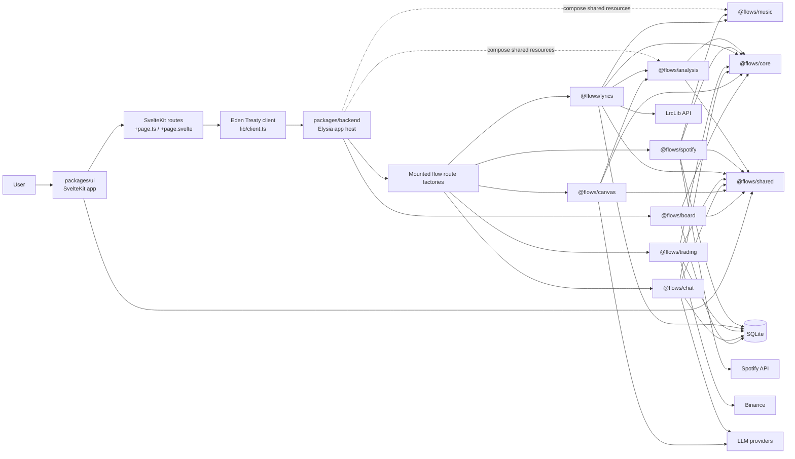
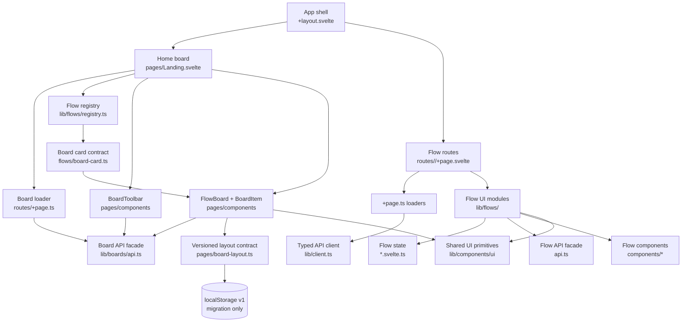
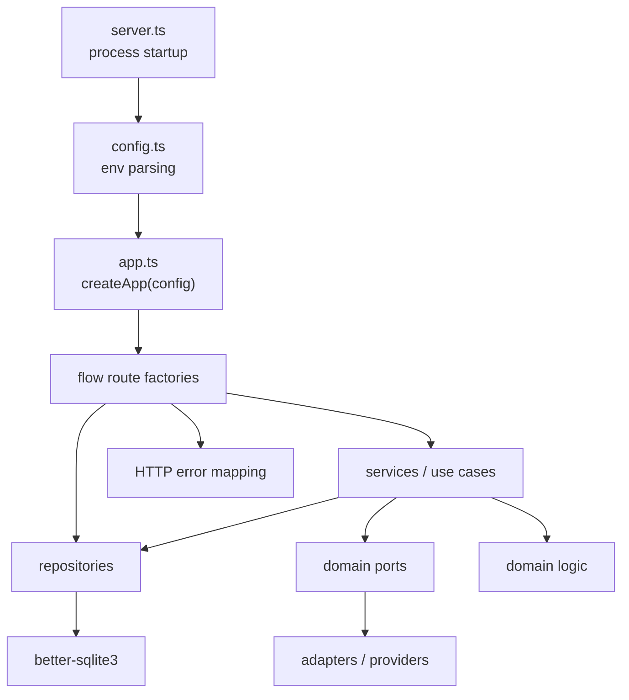

# System Map and Refactor Boundaries

Status: 2026-07-21.

This document is the working map for future cleanup. It describes the current
package/component boundaries, which boundaries are worth keeping, and which
refactor lanes should be tackled next.

Reference baseline: the `ccec` repo has stronger governance and production
discipline than this personal playground. The parts that transfer well are:

- issue-backed execution order
- short-lived branches and PRs into the permanent branch
- typed Eden data access through SvelteKit loaders
- UI primitives instead of repeated ad hoc states
- tests that validate behavior and contracts, not implementation details

The parts that should stay lighter here are deployment, auth, database
migrations, and environment topology.

## Runtime Map

## Workspace Responsibilities

| Workspace           | Role                       | Should Own                                                                                        | Should Not Own                                                         |
| ------------------- | -------------------------- | ------------------------------------------------------------------------------------------------- | ---------------------------------------------------------------------- |
| `packages/backend`  | Application host           | app config, shared resource composition, CORS/static setup, route mounting, process startup split | business rules, SQL, provider SDK calls                                |
| `packages/ui`       | Browser app                | routes, loaders, flow surfaces, registry, UI state, design primitives                             | backend domain internals, raw API URLs, persistent server state        |
| `packages/core`     | Shared infrastructure      | logger, cache, database factory, LLM client/providers                                             | flow-specific business rules, DTOs, route handlers                     |
| `packages/analysis` | Shared analysis capability | tokenization, prompt-safe AST preparation, annotation filtering, `canvas.db` persistence          | flow prompts, schemas, orchestration, UI contracts                     |
| `packages/shared`   | Cross-boundary contract    | DTOs, constants, public unions crossing UI/server                                                 | implementation details, persistence rows, SDK types                    |
| `packages/music`    | Shared music persistence   | `music.db`, track/artist/genre schema, FTS, neutral track repository                              | Spotify API/OAuth, LrcLib, flow orchestration, UI DTO ownership        |
| `packages/board`    | Application composition    | `boards.db`, default/active invariants, board repository/service/routes                           | flow registration, flow internals, deployment or user/account concerns |
| `packages/flows/*`  | Backend bounded contexts   | domain, ports, adapters, repositories, services, Elysia route factory                             | global app startup, unrelated flow logic, UI components                |

## Opinion on Flow Packages

Keeping each backend flow as its own workspace package is the right direction
for this repo, but the goal should be "independently testable bounded modules",
not "five deployable apps" yet.

The separation pays for itself when a flow has at least one of these:

- external adapter concerns, such as Spotify, LrcLib, Binance, or LLM providers
- persistence, migrations, or repository tests
- domain logic that can be tested without Elysia
- package-specific dependencies that should not leak into every other flow
- a plausible future where the flow is extracted or disabled

The separation becomes counterproductive when a package is only a thin route
wrapper with no domain, no tests, and no dependency differences. New flows
should start small, but once they persist data or call an external service they
should follow the package pattern.

### Flow Extraction Contract

A flow is "extractable enough" when these are true:

- It exports a route factory from `src/index.ts`.
- Its public client/server DTOs live in `@flows/shared`.
- It does not import sibling flow internals.
- External APIs live behind adapters implementing domain ports.
- SQL is isolated to `repository.ts` or clearly named repository files.
- Runtime config is passed into factories or named env factories.
- Importing the public package entrypoint does not create files, mutate schema, or open
  provider clients.
- Database handles are created in named composition factories and injected into
  repositories/services; tests use explicit in-memory handles or port fakes.
- It has focused package tests for domain, repositories, services, and routes
  where relevant.
- Its README documents route prefixes, env vars, external services, and test
  commands.

Shared track persistence is owned by `@flows/music`. Spotify and Lyrics may depend on its
public exports; they must not import each other's internals.

Generic text-analysis capabilities are owned by `@flows/analysis`. Canvas and Lyrics may
depend on its public exports; analysis depends only on `@flows/core` and `@flows/shared`.
The manifest dependency graph is enforced by `pnpm check:architecture`.

The backend host creates one Music database and one Analysis repository per assembled
application and injects them into their consumers. Flow-owned stores such as Trading and
Chat are created by their route dependency factories. Public entrypoints remain safe to
import; `pnpm check:runtime` verifies compiled imports from an empty temporary directory.

Named-board persistence is owned by `@flows/board`. Flow packages must not depend on it;
the backend host mounts it and the UI consumes only its contracts from `@flows/shared`.

## Frontend Component Map

Target shape:

- Route files stay thin: load data, pass props, render the flow surface.
- Flow surfaces own page-level composition.
- Components own visual fragments and ephemeral UI state.
- Registered flows own summary/expansion production behind a generic board card contract;
  `BoardCardContent` owns rendering and never imports flow-specific modules.
- `*.svelte.ts` modules own reusable flow state only when there is a documented
  reason not to keep state local.
- Server data comes from loaders and Eden, then mutations call Eden and
  invalidate the relevant loader key.
- Raw `fetch` is limited to cases Eden does not model cleanly, such as SSE.

## Backend Component Map

Target shape:

- `server.ts` is the only file that starts listening.
- `app.ts` is import-safe and testable with `app.handle(...)`.
- Route handlers validate, map HTTP to domain, and call services or
  repositories.
- Services orchestrate use cases but do not own SQL or HTTP response details.
- Repositories own SQL and row hydration.
- Domain code is pure TypeScript.

## Architecture Closure Status

Completed design-system, loader/invalidation, environment ownership, music persistence,
architecture-contract, quality-gate, and named-board work lives in project history and
merged PRs. The post-Board audit queue #82 through #87 is complete: compiled runtime,
dependency security, neutral analysis, import-safe persistence, typed Lyrics Canvas
transport, and documentation/CI reconciliation. See the [roadmap](../ROADMAP.md).

The queue intentionally keeps both `@flows/music` and `@flows/analysis` separate from
`@flows/core`: the neutral packages own domain capabilities, while core remains generic
runtime infrastructure. #84 established and automated that dependency direction. Future
findings must become scoped issues with acceptance criteria before they enter the roadmap;
this document does not maintain a parallel backlog.

Relationships/edges remain a later product decision. They are not implied technical debt
and require a separate issue after an interaction requirement is agreed.
