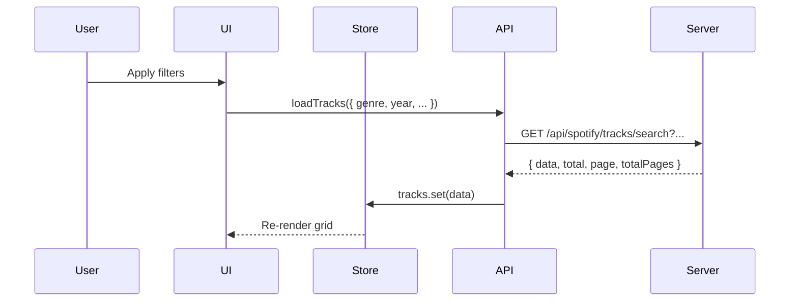

# UI Architecture

## Tech Stack

| Technology | Version | Purpose |
|------------|---------|---------|
| **Svelte** | 5.x | Reactive UI framework |
| **Vite** | 7.x | Build tool & dev server |
| **Tailwind CSS** | 4.x | Utility-first styling |
| **TypeScript** | 5.x | Type safety |

## Directory Structure

```
ui/
├── src/
│   ├── App.svelte              # Router (hash-based)
│   ├── main.ts                 # Entry point
│   ├── app.css                 # Global styles + Tailwind
│   └── lib/
│       ├── config.ts           # API endpoints
│       ├── api.ts              # API client (loadTracks, fetchFromSpotify)
│       ├── types.ts            # TypeScript interfaces
│       ├── stores.ts           # Svelte stores (server-side pagination)
│       ├── utils.ts            # Utilities (debounce)
│       ├── pages/
│       │   ├── index.ts
│       │   ├── Landing.svelte  # Home page with flow cards
│       │   └── SpotifyFlow.svelte
│       └── components/
│           ├── index.ts
│           ├── Controls.svelte     # Refresh/Sync buttons
│           ├── FilterPanel.svelte  # Expandable filter panel
│           ├── MetricCard.svelte
│           ├── Pagination.svelte
│           ├── SearchBar.svelte
│           ├── StatusBanner.svelte
│           └── TrackCard.svelte    # With album art, artist avatar, Spotify link
├── vite.config.ts
├── tailwind.config.js
├── eslint.config.js
└── .prettierrc
```

## Pages

| Page | Route | Description |
|------|-------|-------------|
| **Landing** | `#/` | Flow selection (toolbox) |
| **SpotifyFlow** | `#/spotify` | Track explorer with filters |

## State Management

Uses Svelte stores with **server-side pagination**:

```typescript
// stores.ts
export const tracks = writable<Track[]>([]);
export const totalTracks = writable(0);
export const searchOptions = writable<SearchOptions>({});
export const topStats = writable({ total: 0, artists: 0, topGenre: '—' });
```

## API Client

| Function | Purpose |
|----------|---------|
| `loadTracks(options)` | Fetch paginated tracks with filters |
| `updateStats()` | Fetch summary statistics |
| `fetchFromSpotify()` | Trigger sync from Spotify API |

## Filter Panel Features

The `FilterPanel` component provides:

- **Genre** dropdown
- **Year** dropdown
- **Sort By** (Date Added, Popularity, Title)
- **Sort Order** (Asc/Desc)
- **Min Popularity** slider (0-100)
- **Has Preview** checkbox

## TrackCard Features

Each track card displays:

- Album art (300px)
- **Artist avatar** (circular, 160px) or initials fallback
- Title, artists, album name
- Genre badges (top 2)
- Popularity bar
- Added date
- **Spotify link** (green button on hover)
- **Preview button** (if available)

## Data Flow



## Tooling

| Script | Command | Purpose |
|--------|---------|---------|
| `dev` | `npm run dev` | Start dev server (port 5173) |
| `build` | `npm run build` | Production build |
| `lint` | `npm run lint` | ESLint check |
| `format` | `npm run format` | Prettier format |
| `check` | `npm run check` | Svelte + TypeScript check |
