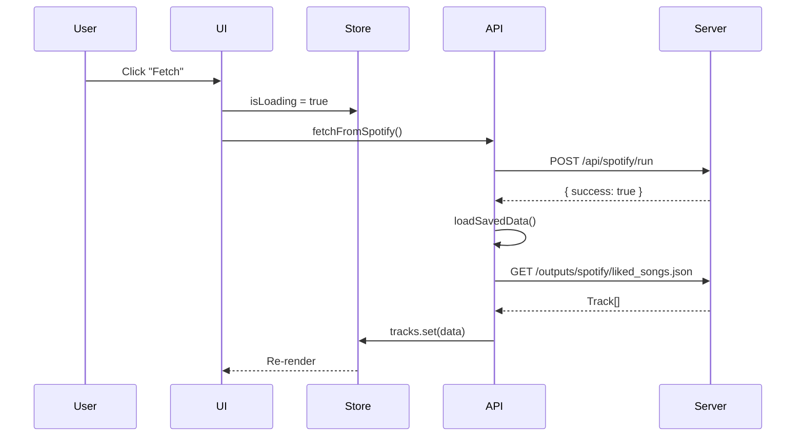

# UI Architecture

## Tech Stack

| Technology | Version | Purpose |
|------------|---------|---------|
| **Svelte** | 5.x | Reactive UI framework |
| **Vite** | 7.x | Build tool & dev server |
| **Tailwind CSS** | 4.x | Utility-first styling |
| **TypeScript** | 5.x | Type safety |

## Directory Structure

```
ui/
├── src/
│   ├── App.svelte          # Main application component
│   ├── main.ts             # Entry point
│   ├── app.css             # Global styles + Tailwind
│   └── lib/
│       ├── config.ts       # Constants (endpoints, app config)
│       ├── api.ts          # API client functions
│       ├── types.ts        # TypeScript interfaces
│       ├── stores/
│       │   └── index.ts    # Svelte stores (state management)
│       └── components/
│           ├── index.ts    # Barrel exports
│           ├── Controls.svelte
│           ├── MetricCard.svelte
│           ├── StatusBanner.svelte
│           └── TrackCard.svelte
├── vite.config.ts          # Vite configuration
├── tailwind.config.js      # Tailwind configuration
├── eslint.config.js        # ESLint (flat config)
└── .prettierrc             # Prettier configuration
```

## State Management

Uses Svelte's built-in stores:

```typescript
// stores/index.ts
export const tracks = writable<Track[]>([]);
export const filter = writable<TimeFilter>('all');
export const status = writable<StatusState>({ message: '...', tone: 'info' });
export const isLoading = writable(false);

// Derived stores
export const filteredTracks = derived([tracks, filter], ...);
export const metrics = derived(filteredTracks, ...);
```

## Data Flow



## Tooling

| Script | Command | Purpose |
|--------|---------|---------|
| `dev` | `npm run dev` | Start dev server (port 5173) |
| `build` | `npm run build` | Production build |
| `lint` | `npm run lint` | ESLint check |
| `format` | `npm run format` | Prettier format |
| `check` | `npm run check` | Svelte + TypeScript check |
