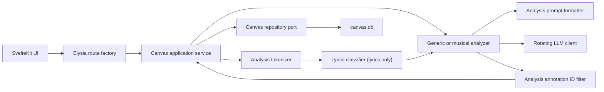

# Canvas And Lyrics Architecture

Canvas provides generic tokenized-text analysis. Lyrics adds the music-specific source,
section classification, prompt, and annotation layers. Both run in-process inside the
single backend host; neither package is a separately deployed application.

## Ownership

| Concern | Owner | Notes |
| --- | --- | --- |
| Token and analysis DTOs | `@flows/shared` | Cross-wire types used by backend and UI |
| Generic tokenization | `@flows/analysis` | Blank-line sections and deterministic token IDs only |
| Prompt-safe AST formatting | `@flows/analysis` | Preserves lines/sections; exposes only token IDs |
| Annotation ID filtering | `@flows/analysis` | Rejects references absent from the source AST |
| Analysis persistence | `@flows/analysis` | Generic `canvas.db` repository |
| Generic text orchestration | `@flows/canvas` | Service, analyzer, repository adapter, HTTP mapping |
| Music section classification | `@flows/lyrics` | Verse, Chorus, Bridge, Pre-Chorus, Intro, and Outro |
| Musical analysis | `@flows/lyrics` | Chord, vocal, meaning prompts and schemas |
| Rendering | `@flows/ui` | Shared token renderer plus Canvas/Lyrics screens |

Analysis and Core never infer music concepts. Lyrics classifies the generic AST after tokenization
without changing section IDs, token IDs, or persisted-analysis compatibility.

## Runtime Flow



The generic Canvas route is created by `createCanvasFlowRoutes()`. Its default
composition uses `CanvasService`, `AnalysisCanvasRepository`, and `analyzeText`; tests inject
an application-service fake and exercise the Elysia app through `.handle()`.

Lyrics owns a separate `LyricsCanvasService`. It reads track/lyrics data through Lyrics
and Music ports, then uses the same tokenizer, formatter, integrity filter, and Canvas
persistence infrastructure.

## Prompt And Annotation Integrity

`formatTokenAstForPrompt()` emits only source words and token IDs:

```text
first[t_001] line[t_002]
second[t_003]

next[t_004] section[t_005]
```

Section labels and `s_NNN` IDs are not included, so the model cannot mistake structural
metadata for annotatable text. After phrase annotations are expanded, both analyzers run
`filterAnnotationsForAst()`. Any generated `tokenId` not present in the source AST is
logged as a dropped annotation and never reaches persistence.

## HTTP Contract

| Endpoint | Success | Missing source | Provider failure |
| --- | --- | --- | --- |
| `GET /api/canvas` | `200` user canvases | n/a | n/a |
| `GET /api/canvas/:sourceId` | `200` analysis | `404` | n/a |
| `POST /api/canvas` | `200` persisted analysis | validation `422` | sanitized `503` |
| `DELETE /api/canvas/:sourceId` | `200 { success: true }` | `404` | n/a |
| `GET /api/lyrics/:trackId/canvas` | `200` analysis or `needsAnalysis` state | `404` track/lyrics | n/a |
| `POST /api/lyrics/:trackId/canvas/analyze` | `200` persisted analysis | `400` unavailable source | sanitized `503` |

Lyrics Canvas request/response DTOs and stable error codes live in `@flows/shared`.
Both JSON endpoints publish TypeBox response schemas and the UI consumes their inferred
success/error unions through Eden. The only raw Lyrics transport is the interpretation
SSE endpoint, whose stream events are validated before reaching UI state.

Provider/model metadata from successful rotation is persisted. Provider response bodies
and internal errors remain in server logs and are never returned to clients.

## Persistence

`canvas.db` stores generic serialized ASTs, annotations, layers, metadata, and actual
provider/model identifiers. The schema remains backward compatible with analyses created
before music classification moved into Lyrics; existing rows are read unchanged.

## Tests

- Analysis package tests cover deterministic tokenization, prompt formatting, ID
  filtering, and persistence.
- Lyrics domain tests cover English/Spanish section markers and legacy defaults.
- Analyzer tests cover prompt shape, expansion, invalid IDs, metadata, and failures.
- Service tests cover orchestration and persistence contracts.
- Route tests use Elysia `.handle()` and assert status/error mapping.
- Focused Playwright checks cover generic Canvas and Lyrics Canvas user paths.

Analysis version history and annotation indexing remain deferred product/performance
decisions. They are not required by the current architecture.
