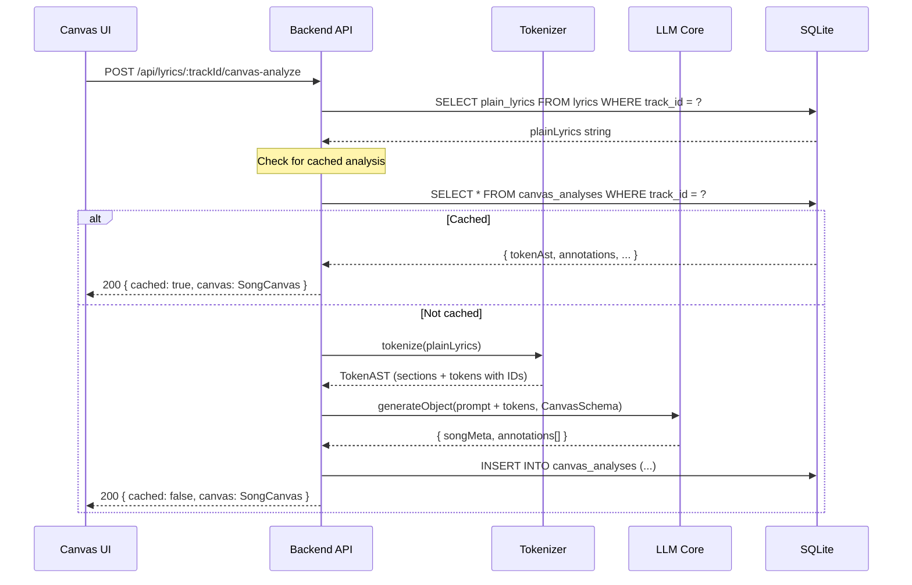

# Lyrics Canvas: Technical Architecture

> Nodos técnicos, flujo de datos, y estructura de implementación.

---

## System Nodes

```mermaid
flowchart TD
    subgraph UI ["UI (Svelte 5)"]
        CANVAS_PAGE["LyricsCanvas.svelte<br/>Full-page view"]
        TOKEN_RENDERER["TokenRenderer.svelte<br/>Renders token spans"]
        LAYER_TOGGLE["LayerToggle.svelte<br/>Chords / Vocal / Prod"]
        TOOLTIP["TokenTooltip.svelte<br/>Hover detail"]
        API_CLIENT["canvas-api.ts<br/>Fetch + SSE client"]
    end

    subgraph BACKEND ["Backend (Elysia)"]
        ROUTES["canvas.routes.ts<br/>POST analyze, GET cached"]
        SERVICE["canvas.service.ts<br/>Orchestration"]
        TOKENIZER["tokenizer.ts<br/>Lyrics → Token AST"]
        LLM_CALL["LLM structured call<br/>Token AST → Annotations"]
    end

    subgraph CORE ["@flows/core (Extended)"]
        LLM_CLIENT["LLMClient.generateObject()<br/>NEW: structured output"]
        SCHEMA["Zod schema<br/>Response validation"]
    end

    subgraph DATA ["Persistence"]
        LYRICS_DB["lyrics table<br/>(existing, untouched)"]
        CANVAS_DB["canvas_analyses table<br/>(NEW)"]
    end

    CANVAS_PAGE --> TOKEN_RENDERER
    CANVAS_PAGE --> LAYER_TOGGLE
    TOKEN_RENDERER --> TOOLTIP
    CANVAS_PAGE --> API_CLIENT

    API_CLIENT -->|"POST /analyze"| ROUTES
    API_CLIENT -->|"GET /analysis"| ROUTES
    ROUTES --> SERVICE
    SERVICE --> TOKENIZER
    SERVICE --> LLM_CALL
    LLM_CALL --> LLM_CLIENT
    LLM_CLIENT --> SCHEMA

    SERVICE -->|"read lyrics"| LYRICS_DB
    SERVICE -->|"read/write analysis"| CANVAS_DB
```



---

## Data Flow: Analyze Request



---

## Database Schema

```sql
-- New table, same SQLite database as lyrics
CREATE TABLE IF NOT EXISTS canvas_analyses (
    id TEXT PRIMARY KEY,
    track_id TEXT NOT NULL UNIQUE,
    token_ast TEXT NOT NULL,         -- JSON: tokenized structure
    annotations TEXT NOT NULL,       -- JSON: LLM annotations
    song_meta TEXT,                  -- JSON: key, bpm, mood
    model_used TEXT NOT NULL,        -- which LLM model generated this
    provider_used TEXT NOT NULL,     -- which provider
    created_at TEXT NOT NULL,
    updated_at TEXT NOT NULL,
    FOREIGN KEY(track_id) REFERENCES lyrics(track_id) ON DELETE CASCADE
);

CREATE INDEX IF NOT EXISTS idx_canvas_track ON canvas_analyses(track_id);
```

**Design decisions:**
- `UNIQUE` on `track_id`: one analysis per track (re-analyze overwrites)
- `ON DELETE CASCADE`: if lyrics are deleted, canvas analysis goes too
- JSON columns for `token_ast` and `annotations`: flexible, no schema migration needed for structure changes
- `model_used` + `provider_used`: traceability of which AI generated the analysis

---

## File Structure (Implementation)

```
packages/
├── core/src/llm/
│   ├── llm-client.ts          ← MODIFY: add generateObject()
│   └── providers/
│       ├── types.ts           ← MODIFY: add structured output types
│       └── gemini/
│           └── gemini-provider.ts  ← MODIFY: implement structured generation
│
├── shared/src/
│   ├── canvas.types.ts        ← NEW: TokenAnnotation, SongCanvas, etc.
│   └── index.ts               ← MODIFY: export canvas types
│
├── flows/lyrics/src/
│   ├── backend/
│   │   ├── routes.ts          ← MODIFY: add canvas routes
│   │   ├── services/
│   │   │   └── canvas.service.ts   ← NEW: orchestration
│   │   └── canvas/
│   │       ├── tokenizer.ts        ← NEW: lyrics → token AST
│   │       └── schemas.ts          ← NEW: Zod schemas for LLM
│   └── index.ts               ← MODIFY: export new routes
│
├── ui/src/lib/flows/lyrics/
│   ├── LyricsCanvas.svelte    ← NEW: full-page canvas view
│   ├── components/
│   │   ├── LyricsModal.svelte      ← UNTOUCHED
│   │   ├── TokenRenderer.svelte    ← NEW
│   │   ├── LayerToggle.svelte      ← NEW
│   │   └── TokenTooltip.svelte     ← NEW
│   ├── canvas-api.ts          ← NEW: API client for canvas
│   └── index.ts               ← MODIFY: register canvas route
│
└── docs/flows/lyrics-canvas/  ← NEW (this documentation)
```

---

## Testing Strategy

| Layer | What to test | How |
| ----- | ------------ | --- |
| **Tokenizer** | Deterministic: given lyrics, produces expected token AST | Unit tests (Vitest) — no LLM needed |
| **Zod Schema** | Validates LLM responses, rejects malformed JSON | Unit tests with fixtures |
| **Canvas Service** | Orchestration: tokenize → LLM → persist → return | Integration test with mocked LLM |
| **API Routes** | Endpoints return correct status codes and shapes | Request tests |
| **UI Components** | TokenRenderer renders correct spans, layers toggle | Component tests or E2E |
