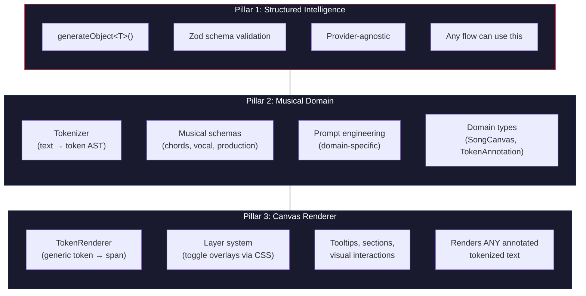
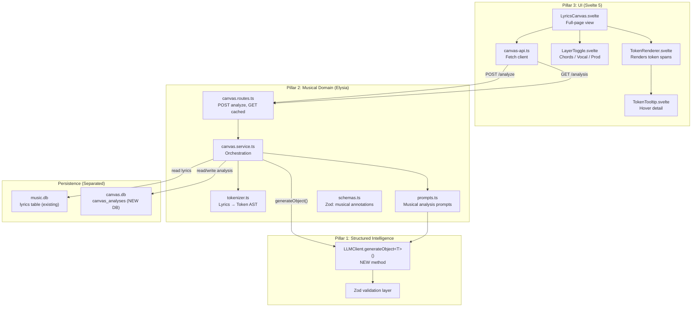
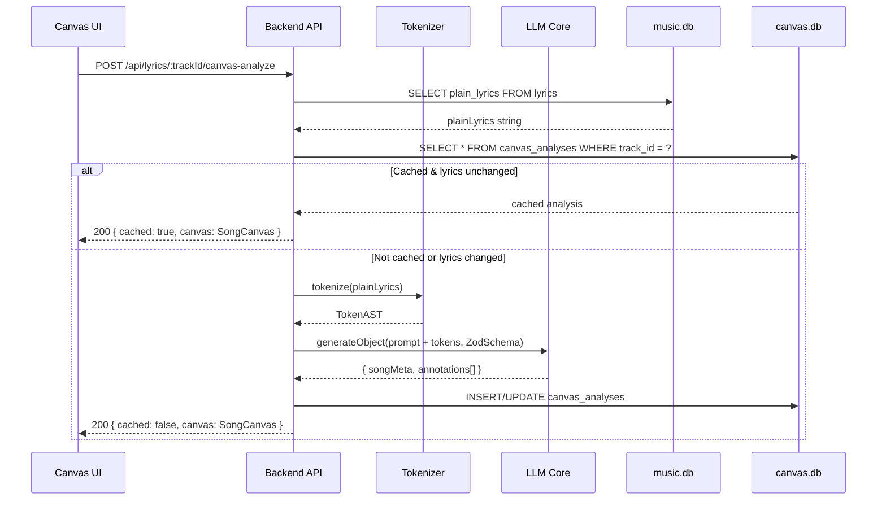

# Lyrics Canvas: Technical Architecture

> Nodos técnicos, flujo de datos, y estructura de implementación.

---

## Three Pillars

The system is built around three independent centers of gravity. Each can evolve, be reused, and be tested in isolation.



### Why separate them

| Pillar | Lives in | Reusable for |
| ------ | -------- | ------------ |
| **Structured Intelligence** | `@flows/core/llm` | Chat structured responses, Trading analysis, any future flow that needs JSON from an LLM |
| **Musical Domain** | `@flows/lyrics` (backend) | Different musical analyses, different song sources, future features like contextual meaning |
| **Canvas Renderer** | `@flows/ui` (components) | Rendering user-written text, poetry analysis, any tokenized content with layered annotations |

> [!IMPORTANT]
> The Canvas Renderer doesn't know about music. It knows about **tokens with typed annotations and toggleable layers**. This is what enables using it for user-written text in the future — the renderer doesn't care if the input is lyrics or a poem.

---

## System Nodes



---

## Database Separation

Two databases, two concerns:

| Database | What it stores | Owned by |
| -------- | -------------- | -------- |
| `music.db` | Tracks, artists, genres, lyrics, interpretation | Spotify Flow + Lyrics Flow (existing) |
| `canvas.db` | Token ASTs, annotations, analysis metadata | Canvas (new, independent) |

```sql
-- canvas.db — Independent database for canvas analyses
CREATE TABLE IF NOT EXISTS canvas_analyses (
    id TEXT PRIMARY KEY,
    track_id TEXT NOT NULL UNIQUE,     -- references external track, but no FK across DBs
    source_text_hash TEXT NOT NULL,    -- hash of input lyrics (detect if lyrics changed)
    token_ast TEXT NOT NULL,           -- JSON: tokenized structure (Pillar 2 output)
    annotations TEXT NOT NULL,         -- JSON: LLM annotations (Pillar 1 output)
    song_meta TEXT,                    -- JSON: key, bpm, mood
    model_used TEXT NOT NULL,
    provider_used TEXT NOT NULL,
    created_at TEXT NOT NULL,
    updated_at TEXT NOT NULL
);

CREATE INDEX IF NOT EXISTS idx_canvas_track ON canvas_analyses(track_id);
```

**Why a separate DB:**
- Canvas concerns don't pollute the music data
- Can be reset/wiped independently ("re-analyze everything" without touching lyrics)
- Future: when Canvas supports user-written text, this DB stores those too — no coupling to Spotify tracks
- The `source_text_hash` detects if the underlying lyrics changed since last analysis, triggering re-analysis if needed

---

## Data Flow: Analyze Request



---

## File Structure

```
packages/
├── core/src/llm/                         ──── PILLAR 1
│   ├── llm-client.ts                     ← MODIFY: add generateObject<T>()
│   └── providers/
│       ├── types.ts                      ← MODIFY: add StructuredOutputRequest
│       └── gemini/
│           └── gemini-provider.ts        ← MODIFY: implement structured generation
│
├── shared/src/                           ──── SHARED TYPES
│   ├── canvas.types.ts                   ← NEW: generic token/annotation types
│   └── index.ts                          ← MODIFY: export canvas types
│
├── flows/lyrics/src/                     ──── PILLAR 2
│   ├── backend/
│   │   ├── routes.ts                     ← MODIFY: mount canvas routes
│   │   └── canvas/
│   │       ├── canvas.routes.ts          ← NEW: Elysia routes for canvas
│   │       ├── canvas.service.ts         ← NEW: orchestration
│   │       ├── canvas.repository.ts      ← NEW: canvas.db access
│   │       ├── tokenizer.ts             ← NEW: lyrics → token AST
│   │       ├── prompts.ts              ← NEW: musical analysis prompts
│   │       └── schemas.ts             ← NEW: Zod schemas for LLM response
│   └── index.ts                          ← MODIFY: export canvas routes
│
├── ui/src/lib/flows/lyrics/              ──── PILLAR 3
│   ├── LyricsCanvas.svelte               ← NEW: full-page canvas view
│   ├── components/
│   │   ├── LyricsModal.svelte            ← UNTOUCHED
│   │   ├── TokenRenderer.svelte          ← NEW: generic token renderer
│   │   ├── LayerToggle.svelte            ← NEW: layer toggle controls
│   │   └── TokenTooltip.svelte           ← NEW: hover detail panel
│   ├── canvas-api.ts                     ← NEW: API client for canvas
│   └── index.ts                          ← MODIFY: register canvas route
│
└── docs/flows/lyrics-canvas/            ──── DOCUMENTATION
    ├── flow_introduction.md
    ├── architecture.md (this file)
    └── use-case.md
```

---

## Testing Strategy

| Pillar | Layer | What to test | How |
| ------ | ----- | ------------ | --- |
| 1 | **generateObject** | Returns typed object, validates schema, retries on malformed JSON | Unit tests with mock LLM responses |
| 1 | **Zod Schema** | Accepts valid annotations, rejects malformed | Unit tests with fixtures |
| 2 | **Tokenizer** | Deterministic: given lyrics, produces expected token AST | Unit tests (Vitest) — no LLM needed |
| 2 | **Canvas Service** | Orchestration: tokenize → LLM → persist → return | Integration test with mocked LLM |
| 2 | **Canvas Routes** | Endpoints return correct status codes and shapes | Request tests |
| 3 | **TokenRenderer** | Renders correct spans with data attributes | Component tests |
| 3 | **LayerToggle** | Toggling adds/removes CSS classes on canvas container | Component tests |
