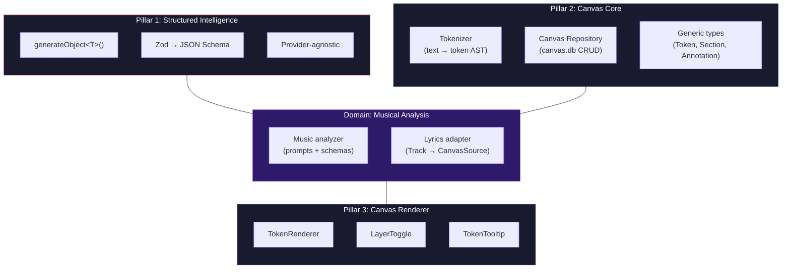
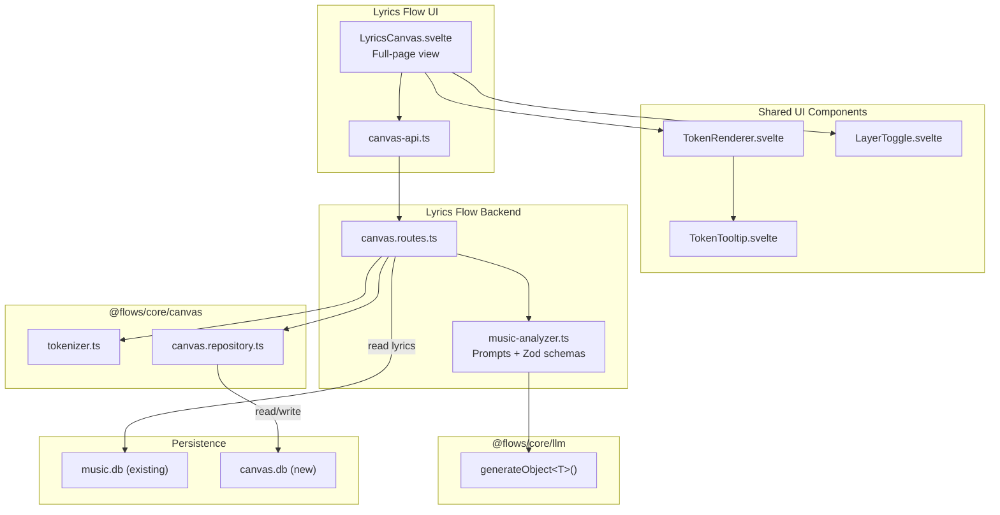

# Lyrics Canvas: Technical Architecture

> Nodos técnicos, flujo de datos, y estructura de implementación.
> Updated: reflects three-pillar separation with Canvas as core infrastructure.

---

## Three Pillars



### Where each lives

| Pillar | Package | Reusable for |
| ------ | ------- | ------------ |
| **Structured Intelligence** | `@flows/core/llm` | Any flow needing typed JSON from LLM |
| **Canvas Core** | `@flows/core/canvas` | Any tokenized text analysis |
| **Canvas Renderer** | `@flows/ui/components/canvas` | Any annotated text UI |
| **Musical Domain** | `@flows/lyrics/canvas` | Lyrics-specific musical analysis |

---

## System Nodes



---

## Database

Two databases, two concerns:

```sql
-- canvas.db — Independent, owned by @flows/core/canvas
CREATE TABLE IF NOT EXISTS canvas_analyses (
    id TEXT PRIMARY KEY,
    source_id TEXT NOT NULL UNIQUE,
    source_type TEXT NOT NULL DEFAULT 'track',
    source_text_hash TEXT NOT NULL,
    token_ast TEXT NOT NULL,
    annotations TEXT NOT NULL,
    meta TEXT,
    model_used TEXT NOT NULL,
    provider_used TEXT NOT NULL,
    created_at TEXT NOT NULL,
    updated_at TEXT NOT NULL
);

CREATE INDEX IF NOT EXISTS idx_canvas_source ON canvas_analyses(source_id);
```

---

## File Structure

```
packages/
├── core/src/
│   ├── llm/                              ──── PILLAR 1 (MODIFY)
│   │   ├── llm-client.ts                 ← add generateObject<T>()
│   │   └── providers/
│   │       ├── types.ts                  ← add StructuredOutputRequest
│   │       └── gemini/gemini-provider.ts ← implement responseJsonSchema
│   │
│   ├── canvas/                           ──── PILLAR 2 (NEW)
│   │   ├── tokenizer.ts                  ← text → token AST (generic)
│   │   ├── canvas.repository.ts          ← canvas.db CRUD (generic)
│   │   └── index.ts
│   │
│   └── index.ts                          ← export canvas module
│
├── shared/src/
│   ├── canvas.types.ts                   ← NEW: Token, Section, CanvasSource
│   ├── canvas-music.types.ts             ← NEW: ChordAnnotation, SongMeta
│   └── index.ts                          ← export canvas types
│
├── flows/lyrics/src/
│   └── backend/
│       ├── routes.ts                     ← mount canvas routes via .use()
│       └── canvas/                       ──── DOMAIN (NEW)
│           ├── canvas.routes.ts          ← Elysia routes
│           ├── music-analyzer.ts         ← prompts + Zod schema
│           └── index.ts
│
├── ui/src/lib/
│   ├── components/
│   │   └── canvas/                       ──── PILLAR 3 (NEW, SHARED)
│   │       ├── TokenRenderer.svelte
│   │       ├── LayerToggle.svelte
│   │       ├── TokenTooltip.svelte
│   │       └── index.ts
│   │
│   └── flows/lyrics/
│       ├── LyricsCanvas.svelte           ← NEW: page (uses shared components)
│       ├── canvas-api.ts                 ← NEW: API client
│       ├── LyricsFlow.svelte             ← MODIFY: add "Open Canvas" link
│       └── components/
│           └── LyricsModal.svelte        ← UNTOUCHED
│
└── docs/
    ├── flows/lyrics-canvas/              ← flow documentation
    └── high-level/                       ← design discussions
```

---

## Testing Strategy

| Pillar | What | How |
| ------ | ---- | --- |
| **Core: LLM** | `generateObject<T>()` returns typed, validated object | Unit test with mocked Gemini response |
| **Core: Canvas** | Tokenizer produces deterministic AST | Unit tests (Vitest) |
| **Core: Canvas** | Repository CRUD on canvas.db | Integration test |
| **Domain** | Music analyzer schemas validate correctly | Unit tests with fixtures |
| **UI** | TokenRenderer renders spans with data attributes | Component test |
