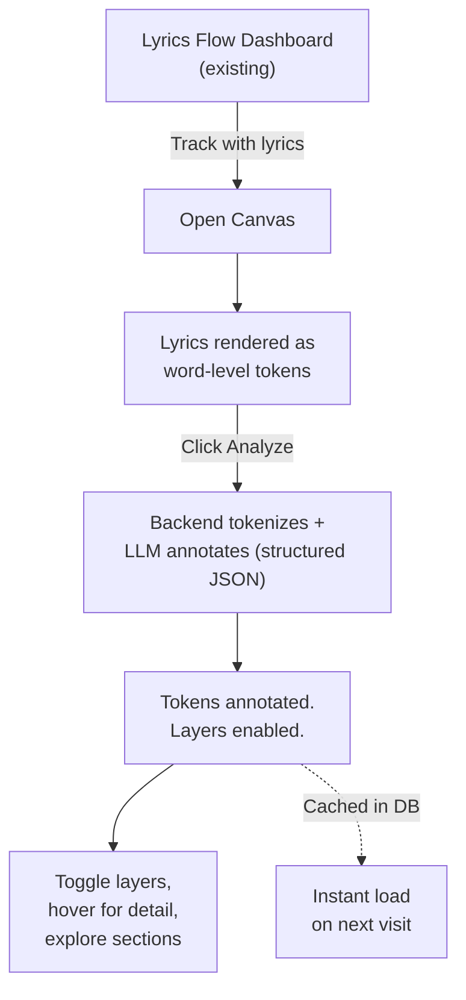
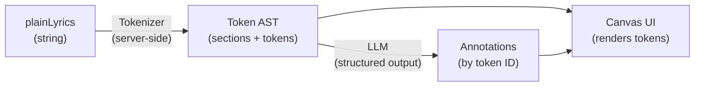

# The Lyrics Canvas: From Text to Musical Insight

> **Status**: Spike / PoC
> **Philosophy**: "Words are not flat. Every syllable carries layers of musical intention — the Canvas makes them visible."

## The Problem

Lyrics exist in music apps as **dead text**. A wall of words disconnected from the music they serve. You read them, but you can't *see* the chord that shifts the emotion on "soñarla", the belt technique that makes "música" hit differently, or the production choice that strips the instruments before "No, enciendan la radio."

The existing Lyrics Flow fetches and displays lyrics. The AI Interpretation feature explains *what* a song means. But neither lets you **interact with the text as a musical object**.

## The Solution

A **Canvas** — a workspace where lyrics become a system of interactive tokens. Each word is a node that can carry layers of structured musical metadata, generated by AI and toggled by the user.

The core insight: **separation of concerns, visually**. Instead of one AI-generated essay about the song, the Canvas provides three independent lenses:

| Layer | What it reveals | Visual |
| ----- | --------------- | ------ |
| 🎸 **Harmony** | Where chords change, tonal shifts, key relationships | Chord symbols above tokens |
| 🎤 **Vocal** | Technique, dynamics, phrasing decisions | Badges below tokens |
| 🎛️ **Production** | Sound design, arrangement, mix changes | Margin annotations per section |

Each layer can be toggled independently. Combined, they paint a complete picture of a song's construction.

## The Flow



### Key Interactions

1. **Entry**: From the Lyrics Flow dashboard, tracks with lyrics show an "Open Canvas" action
2. **Canvas View**: Full-page workspace. Lyrics displayed as tokenized text (each word = `<span>`)
3. **Analyze**: One button sends lyrics to AI → structured JSON response with annotations
4. **Explore**: Toggle layers on/off. Hover annotated tokens for rich detail tooltips
5. **Persist**: Analysis cached in DB. Next visit loads instantly, no re-analysis needed

## Architecture

### Data Model

The Canvas introduces a **two-phase data pipeline**:

**Phase 1 — Tokenization** (deterministic, no AI):
Plain lyrics text → AST of sections, lines, and word tokens with unique IDs.

**Phase 2 — Annotation** (AI, structured output):
Token AST → LLM with JSON schema → annotations mapped to token IDs.



### Persistence Strategy

The analysis result is **persisted alongside the lyrics data**. This provides:

- **Instant reload**: No re-calling the LLM on revisit
- **Trail / history**: The analysis becomes a baseline that can evolve
- **Reset capability**: User can re-analyze to get fresh annotations

Storage: A dedicated `canvas_analyses` table linked to `track_id`, storing:
- The tokenized AST (the structural skeleton)
- The LLM annotations (the musical intelligence)
- Metadata (model used, timestamp, version)

### Integration Points

```
@flows/core/llm        → Extended with structured output (generateObject)
@flows/shared           → New canvas types (TokenAnnotation, SongCanvas, etc.)
@flows/lyrics (backend) → New service + route for canvas analysis
@flows/lyrics (UI)      → New Canvas page component + token renderer
```

> [!IMPORTANT]
> The Canvas **extends** the Lyrics Flow. It does not replace any existing functionality. The current lyrics modal and AI interpretation feature remain untouched.

## Tech Stack

| Layer | Technology | Why |
| ----- | ---------- | --- |
| **Tokenizer** | TypeScript (server-side) | Deterministic text splitting — no AI needed |
| **AI Analysis** | `@flows/core/llm` + Structured Outputs | JSON schema enforcement, multi-provider |
| **Validation** | Zod | Schema validation for LLM responses |
| **Rendering** | Svelte 5 + CSS | HTML-first. Each token is a `<span>` with data attributes |
| **Persistence** | SQLite (existing) | New table, same database |
| **Visual Layers** | CSS custom properties + data attributes | Layers toggle via CSS class, no re-render |

### Rendering Approach (v1)

Pure HTML/CSS. No canvas element, no WebGL, no p5.js.

Each token is a `<span>` with data attributes:

```html
<span
  class="token"
  data-id="t_012"
  data-chord="B"
  data-vocal="sustained note"
>soñarla</span>
```

Layers toggle visibility via CSS:

```css
/* When chord layer is active */
.canvas--chords .token[data-chord]::before {
  content: attr(data-chord);
  /* positioned above the word */
}
```

This is fast, accessible, inspectable, and testable. Canvas/WebGL rendering is a future evolution, not a v1 concern.

## Future Capabilities

- **Contextual Meaning**: Select a phrase within the Canvas → AI explains its meaning in context of the full song, contrasting with the existing whole-song interpretation
- **User Annotations**: Draw selections, add personal notes, highlight passages manually
- **Custom Text Input**: Apply the same Canvas analysis to user-written text — poetry, prose, original lyrics — not just fetched songs
- **Sub-token Granularity**: Annotate at syllable level for vocal precision (breath marks, pitch contour)
- **Canvas Rendering (HTML-in-Canvas)**: When the WICG API matures, migrate the DOM rendering to a `<canvas>` for visual effects (shaders, audio reactivity)
- **Audio Sync**: Link annotations to playback timestamps using synced lyrics (LRC data already stored)
