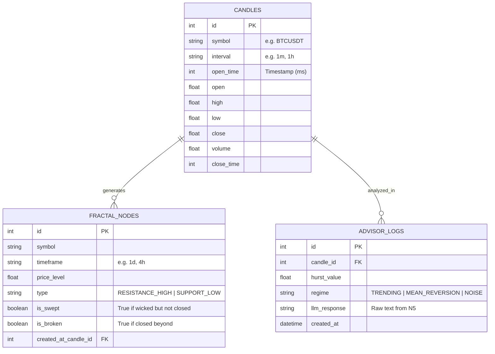
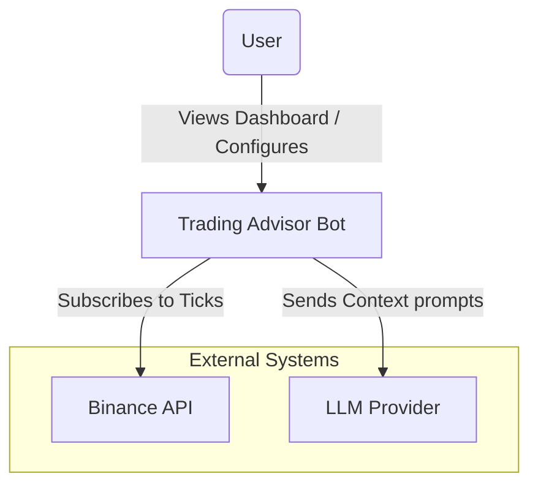
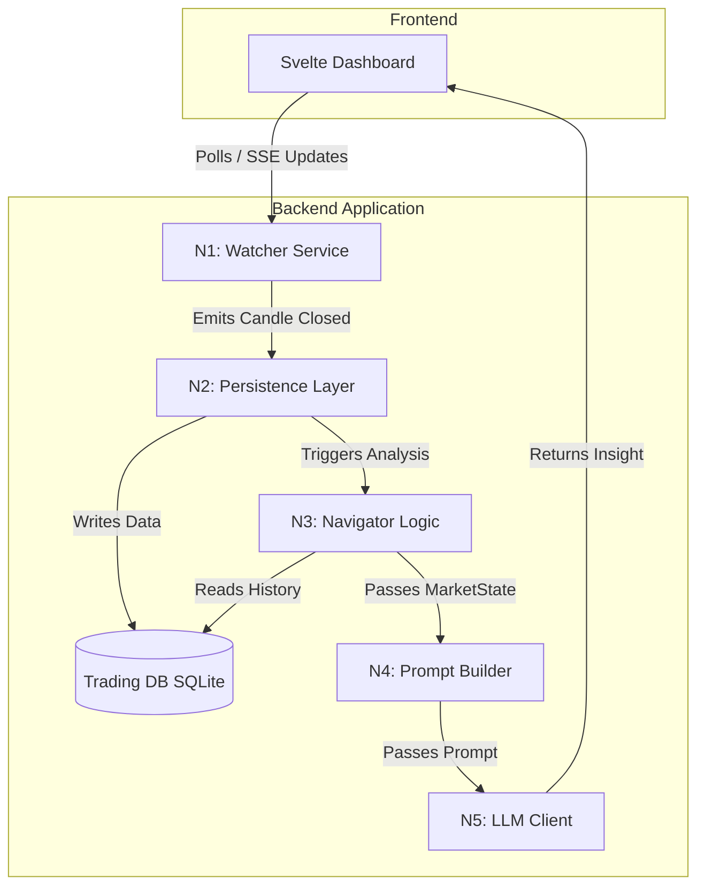
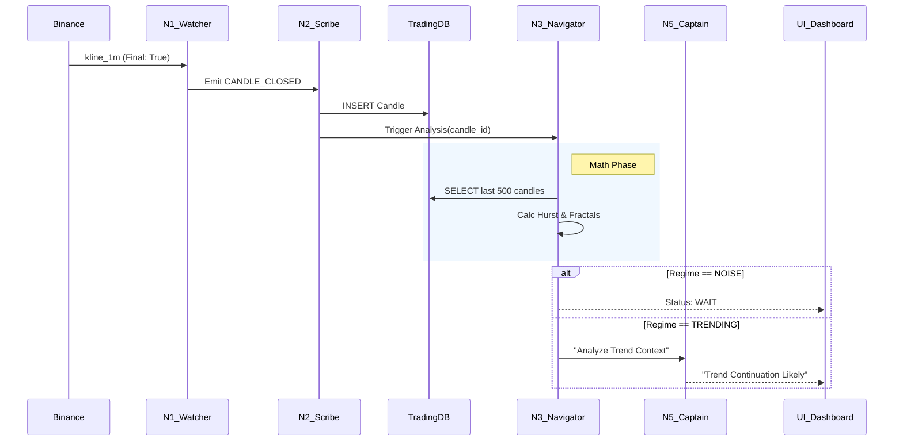

# Architecture Diagrams: Trading Bot Flow

> **Status**: Design Phase
> **Purpose**: Visualizing the structure, databases, and container interactions of the Sovereign Trading Advisor.

## 1. Data Schema (ERD) - `trading.db`

The persistence layer (N2) uses a dedicated SQLite database to ensure isolation. `trading.db` is separate from the main `flow.db`.

## 2. C4 Model - Level 1: System Context

How the Trading Advisor fits into the user's world and external systems.

## 3. C4 Model - Level 2: Container Diagram

The internal anatomy of the "Trading Advisor" system.

## 4. Sequence Diagram: The "Heartbeat" Cycle

The flow of a single minute in the system.

