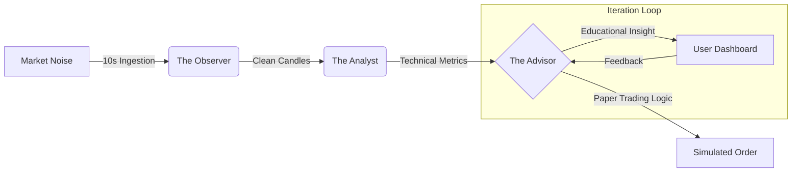
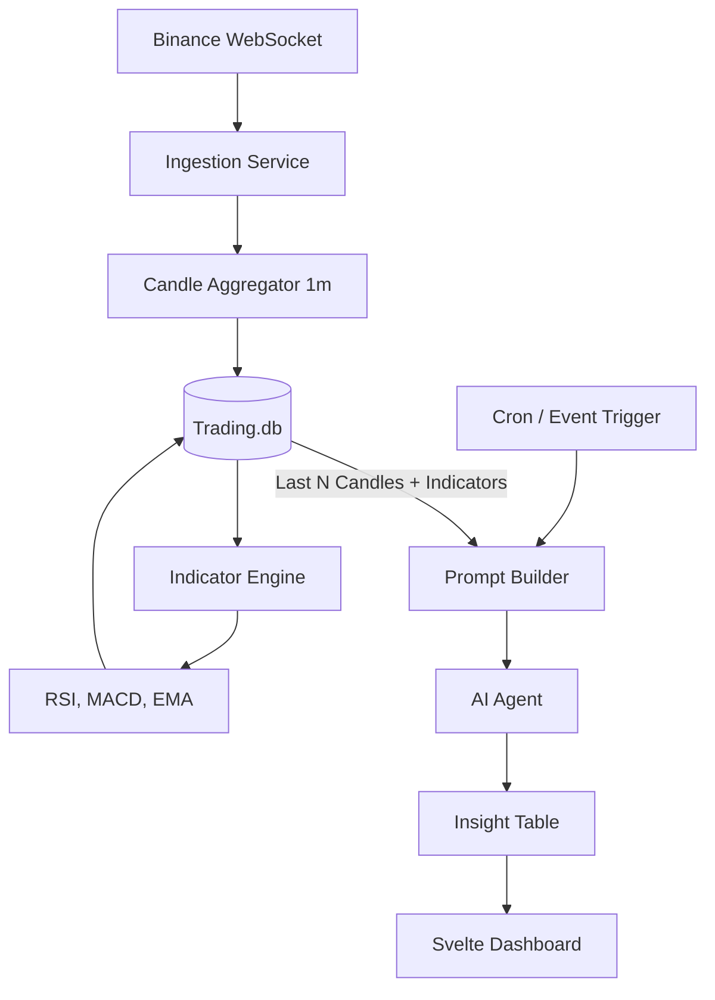

# Architecture & Decisions: Trading Bot Flow

This document captures the structural design and the "Why" behind technology choices.

## 1. High-Level Flow (Human-Centric)

## 2. Technical Flow (System-Centric)

## 3. Technology Decisions

### Node.js vs Python

- **Decision**: Node.js (TypeScript)

- **Rationale**:
  1. **Uniformity**: Keeps the project in a single language/runtime.
  2. **Concurrency**: Node's event loop is excellent for handling multiple WebSockets and asynchronous API calls.
  3. **Library Maturation**: Libraries like `technicalindicators` are stable and fast enough for our 1s-10s resolution.
  4. **Future-Proofing**: If we eventually need heavy AI training (PyTorch), we can bridge to a Python microservice, but for the "Advisor" phase, Node is leaner.

### Database Separation

- **Decision**: `trading.db` (Independent SQLite)

- **Rationale**: Isolation. Market data grows exponentially. Keeping it separate prevents it from bloating the core `flow.db` (Spotify/User data).

### Multi-Agent Intelligence

- **Decision**: Tiered Strategy

- **Code-Level Agents**: Fast, deterministic rules (RSI crossing).
- **Conversational Agents**: LLMs for reasoning and teaching.
