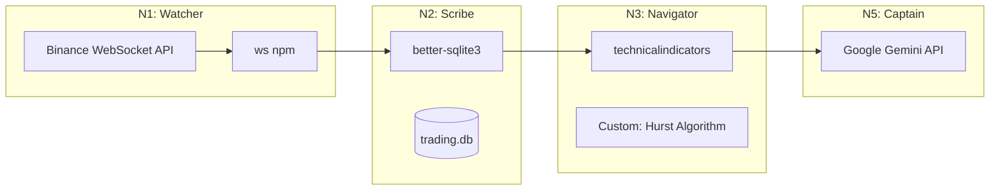

# Tech Docs: Technology Stack & Validation

> **Purpose**: A validated reference of all technologies and third-party services used in the Trading Bot Flow, organized by node. Each entry cites official documentation and flags any limitations or considerations.

## ⚙️ Technology Flow



---

## 1. Binance WebSocket Streams (N1)

- **Role**: Real-time market data ingestion (Candles).
- **Doc Reference**: [Binance WebSocket Streams](https://developers.binance.com/docs/binance-spot-api-docs/web-socket-streams)

### Binance WS Validated Facts

- **Base Endpoint**: `wss://stream.binance.com:9443` (or `:443`).
- **Stream Name for 1m Candles**: `<symbol>@kline_1m` (e.g., `btcusdt@kline_1m`).
- **Update Speed**: `2000ms` for all intervals except `1s`.
- **Payload Key Fields**:
  - `k.o`, `k.h`, `k.l`, `k.c`: OHLC prices (as strings).
  - `k.v`: Volume.
  - `k.t`, `k.T`: Kline start/close time (ms).
  - **`k.x`**: **Boolean - Is this kline closed?** (Crucial for determining when to persist).
- **Connection Lifetime**: Connections are automatically disconnected after **24 hours**. Reconnection logic is mandatory.
- **Ping/Pong**: Server sends a `ping` every 20s. Client must respond with `pong` within 1 minute or be disconnected.
- **Limits**: Max 1024 streams per connection. Max 300 new connections per 5 minutes per IP.

### Binance WS Implementation Notes

- Must implement:
  - Heartbeat handler (pong response).
  - Exponential backoff reconnection on disconnect.
  - Parser to extract `k.x === true` for candle finalization.

---

## 2. `ws` npm Package (N1)

- **Role**: WebSocket client for Node.js to connect to Binance.
- **Doc Reference**: [https://github.com/websockets/ws](https://github.com/websockets/ws)

### ws Package Validated Facts

- A popular, fast, and RFC-6455 compliant WebSocket implementation.
- Does **not** work in the browser (use native `WebSocket` there). Our backend is Node.js, so this is fine.
- Supports binary data, extensions, and custom HTTP headers.
- `npm install ws`.

### ws Package Example Usage

```javascript
import WebSocket from 'ws';

const ws = new WebSocket('wss://stream.binance.com:9443/ws/btcusdt@kline_1m');

ws.on('open', () => console.log('Connected'));
ws.on('message', (data) => console.log(JSON.parse(data.toString())));
ws.on('ping', () => ws.pong()); // Respond to server ping
ws.on('close', () => console.log('Disconnected - Reconnect needed'));
```

---

## 3. `better-sqlite3` (N2)

- **Role**: Synchronous SQLite driver for high-performance local persistence.
- **Doc Reference**: [https://github.com/WiseLibs/better-sqlite3](https://github.com/WiseLibs/better-sqlite3)

### SQLite Validated Facts

- **Synchronous API**: All operations are blocking. This is by design for simplicity and performance in single-threaded scripts.
- **Speed**: Claimed to be the fastest SQLite driver for Node.js.
- **Full Transaction Support**: ACID compliant.
- **WAL Mode**: Recommended for concurrent read/write scenarios. Enabled via `PRAGMA journal_mode = WAL;`.
- `npm install better-sqlite3`.

### SQLite Considerations

- ⚠️ **Blocking**: For high-concurrency web servers, blocking I/O could be an issue. For our use case (processing one candle per minute), this is acceptable and preferred for its simplicity.
- The library requires a C++ build step. Ensure build tools are available on the deployment machine.

### SQLite Example Usage

```javascript
import Database from 'better-sqlite3';
const db = new Database('data/trading.db');
db.pragma('journal_mode = WAL');

const upsertCandle = db.prepare(`
  INSERT INTO candles (symbol, open_time, open, high, low, close, volume)
  VALUES (@symbol, @open_time, @open, @high, @low, @close, @volume)
  ON CONFLICT(symbol, open_time) DO UPDATE SET
    high = MAX(high, @high),
    low = MIN(low, @low),
    close = @close,
    volume = @volume;
`);
```

---

## 4. `technicalindicators` npm (N3)

- **Role**: Calculate RSI, MACD, Bollinger Bands, and other standard trading cues.
- **Doc Reference**: [https://github.com/anandanand84/technicalindicators](https://github.com/anandanand84/technicalindicators)

### Tech Indicators Validated Facts

- A comprehensive, well-tested JavaScript library for technical analysis.
- Available indicators include: `RSI`, `MACD`, `EMA`, `SMA`, `BollingerBands`, `ATR`, and many more.
- Works in both Node.js and browsers.
- `npm install technicalindicators`.

### Tech Indicators Example Usage

```javascript
import { RSI, MACD } from 'technicalindicators';

const rsiValues = RSI.calculate({
  period: 14,
  values: closePrices, // Array of closing prices
});

const macdResult = MACD.calculate({
  values: closePrices,
  fastPeriod: 12,
  slowPeriod: 26,
  signalPeriod: 9,
  SimpleMAOscillator: false, // Use EMA
  SimpleMASignal: false,
});
```

---

## 5. Hurst Exponent Calculation (N3 - Custom)

- **Role**: Determine market regime (Trending vs. Mean-Reverting vs. Noise).
- **Doc Reference**: Academic (No standard npm library available).

### Hurst Validated Facts

- **No dedicated JavaScript/npm library found.** This requires a custom implementation.
- The standard algorithm is **Rescaled Range (R/S) Analysis**.
- Steps:
  1. Calculate log returns.
  2. Divide series into sub-periods.
  3. For each: Mean-center, cumulative sum, find Range, divide by Std Dev.
  4. Regress `log(R/S)` vs `log(n)`. The slope is `H`.
- Python's `hurst` library can be used as a reference for porting.
- Alternatively, a **WebAssembly (WASM)** module could be compiled from Rust/C++ for performance if needed in the future.

### Hurst Implementation Plan

- Create a custom `hurst.ts` utility in `packages/backend/src/trading/math/`.
- Test against known datasets (e.g., Mandelbrot's cotton prices) to validate.

---

## 6. Google Gemini API (N5)

- **Role**: LLM reasoning engine for generating educational insights.
- **Doc Reference**: [Google AI for Developers - Quickstart](https://ai.google.dev/gemini-api/docs/quickstart)

### Gemini API Validated Facts

- **SDK**: Use official `@google/genai` npm package.
- **Streaming**: Supports response streaming via `generateContentStream`.
- **Node.js Version**: Requires Node.js 18+.
- `npm install @google/genai`.

### Gemini API Example Usage

```javascript
import { GoogleGenAI } from '@google/genai';

const ai = new GoogleGenAI({ apiKey: process.env.GEMINI_API_KEY });

async function run(prompt) {
  const response = await ai.models.generateContent({
    model: 'gemini-1.5-flash',
    contents: prompt,
  });
  return response.text;
}

// For streaming:
const streamResult = await ai.models.generateContentStream({
  model: 'gemini-1.5-flash',
  contents: prompt,
});
for await (const chunk of streamResult) {
  process.stdout.write(chunk.text);
}
```

### Gemini API Considerations

- **Pricing**: Gemini 1.5 Flash is the cost-effective option for high-frequency calls per minute.
- **Rate Limits**: Free tier has limits (e.g., 60 RPM). Monitor usage.
- **Alternative (Groq)**: For even faster inference, Groq API with Llama 3 is an option but has different SDK (`groq-sdk`).

---

## Summary: `package.json` Additions

```json
{
  "dependencies": {
    "ws": "^8.x",
    "better-sqlite3": "^9.x",
    "technicalindicators": "^3.x",
    "@google/genai": "^1.x"
  }
}
```
