# 🧙‍♂️ Cascade Analysis Wizard - Flujo de Experiencia V2 (Data-Driven)

> **Evolución**: Este documento integra la Estrategia Manual (Reglas) con el Conocimiento Fractal (Matemáticas) mediante un sistema de prompts enriquecidos con datos duros.

## Objetivo

El Cascade Wizard guía al trader a través de un **análisis multi-timeframe descendente** (top-down), donde cada paso no es solo una "opinión" del LLM sobre un gráfico, sino un **juicio pericial** basado en hechos matemáticos pre-calculados.

## 🧠 Arquitectura de Dos Fuentes

Para evitar alucinaciones, el Prompt se construye fusionando dos fuentes de verdad:

1. **Fuente A: Conocimiento Técnico (Hard Data)**
   - Calculado por el Backend (`AnalystService`).
   - Incluye: Hurst Exponent, Fractales (Precios exactos), ATR (Volatilidad matemática).
   - _El LLM no calcula, el LLM interpreta._

2. **Fuente B: Conocimiento Estratégico (User Rules)**
   - Definido en la `manual-strategy.md`.
   - Incluye: Reglas de "3 Toques", Ratios R:R, Psicología de "Top-Down".

---

## Paso 1: 🌍 Sesgo Macro (Vista 1D) - "El Climatólogo"

**Misión**: Definir el entorno operativo más allá de lo visual.

### Datos Técnicos Inyectados (Backend)

- `hurst_exponent`: 0.72 (Régimen: Tendencia Fuerte).
- `trend_direction`: UP (SMA 200 pendiente positiva).
- `daily_fractal_level`: $95,000 (Soporte Mayor).

### Prompt V2 (Enriquecido)

```text
[FACTS - DO NOT HALLUCINATE]
- Regime: TRENDING (Hurst=0.72).
- Key Level: Price is ABOVE Daily Fractal Support ($95,000).
- Momentum: Bullish (Price > EMA 200).

[STRATEGY - USER RULES]
- Rule: "Trend is friend". If Hurst > 0.6, ignore Overbought signals.
- Focus: Identify if this is a 'Runaway Trend' or a 'Deep Pullback'.

[TASK]
Analyze the provided 1D candles in this context. Determine the Macro Bias using the standard output format.
```

### Output Esperado

```json
{
  "sentiment_bias": "LONG",
  "mentor_tip": "El régimen fractal confirma una tendencia robusta (H=0.72). Ignora la aparente sobrecompra. El precio respeta el soporte de $95k, lo que sugiere que cualquier retroceso es oportunidad de compra."
}
```

---

## Paso 2: 🏗️ Estructura (Vista 4H) - "El Topógrafo"

**Misión**: Validar niveles y estructura de mercado intermedia.

### Datos Técnicos Inyectados (Backend)

- `nearest_resistance`: $98,500 (Fractal 4H).
- `nearest_support`: $96,200.
- `touch_count`: 2 (El precio ha tocado el soporte 2 veces recientemente).

### Prompt V2 (Matrioshka)

```text
[PREVIOUS CONTEXT]
- 1D Bias: LONG (Robust Trend).

[FACTS]
- Structure: Price is ranging between $96.2k and $98.5k.
- Interaction: Support ($96.2k) has 2 recent touches.
- Candle Pattern: Last candle closed as 'Hammer'.

[STRATEGY]
- Rule: "Wait for 3 touches" or clear breakout.
- Rule: Align with 1D bias (Only look for Long setups at support).

[TASK]
Analyze 4H structure. Are we building accumulation for the next leg up?
```

### Output Esperado

```json
{
  "sentiment_bias": "NEUTRAL",
  "mentor_tip": "Estamos en consolidación sobre el soporte de 4H ($96.2k). Llevamos 2 toques; idealmente esperamos un tercer toque o un fallo claro para confirmar la estructura antes de subir."
}
```

---

## Paso 3: 🎯 Setup (Vista 1H) - "El Arquitecto"

**Misión**: Encontrar el patrón de disparo.

### Datos Técnicos Inyectados (Backend)

- `pattern_detected`: Bullish Flag (Bandera Alcista).
- `volatility_atr`: $150.
- `rsi_divergence`: Hidden Bullish (Precio baja, RSI sube).

### Prompt V2 (Matrioshka)

```text
[PREVIOUS CONTEXT]
- 1D: LONG.
- 4H: NEUTRAL (Accumulation at support).

[FACTS]
- Pattern: Potential Bullish Flag forming.
- Signal: Hidden Bullish Divergence detected on RSI.
- Price: Testing the 4H Support ($96.2k) right now.

[STRATEGY]
- Rule: "Confluence is King". Divergence + Structure = High Probability.
- Trigger: Look for Engulfing candle or Pinbar.

[TASK]
Is there a valid setup forming right now?
```

### Output Esperado

```json
{
  "sentiment_bias": "LONG",
  "mentor_tip": "Confluencia Alta: El precio testea el soporte de 4H ($96.2k) con Divergencia Alcista Oculta. Se está formando una Bandera. Preparar entrada."
}
```

---

## Paso 4: ⚡ Entrada (Vista 15m) - "El Estratega"

**Misión**: Ejecución matemática (Sniper).

### Datos Técnicos Inyectados (Backend)

- `current_price`: $96,350.
- `atr_15m`: $40.
- `suggested_stop_loss`: $96,150 (Soporte - 2*ATR).
- `target_level`: $98,500 (Resistencia 4H).

### Prompt V2 (Total Context)

```text
[CHAIN OF THOUGHT]
1. Macro: Bullish Trend (H=0.72).
2. Structure: Support confirmed at $96.2k.
3. Setup: Bullish Flag + Divergence.

[MATH FACTS]
- Current Price: $96,350.
- ATR (Volatility): $40.
- Distance to Risk (SL): $200.
- Distance to Reward (TP): $2,150.

[STRATEGY]
- Rule: Calculate Risk/Reward Ratio.
- Rule: If R:R < 2, ABORT.

[TASK]
Provide final execution advice with precise numbers.
```

### Output Esperado

```json
{
  "sentiment_bias": "LONG",
  "mentor_tip": "EJECUTAR LONG AHORA ($96,350). Stop Loss técnico en $96,100 (Debajo de estructura + holgura ATR). Take Profit en $98,500. Ratio R:R de 1:8. Ejecución impecable."
}
```

---

## 🔄 Flujo de Datos Actualizado (V2)

```mermaid
sequenceDiagram
    participant U as Usuario
    participant W as Wizard UI
    participant B as Backend Orc
    participant M as Math Engine
    participant LLM as Modelo IA

    U->>W: Inicia Paso 1 (1D)
    W->>B: requestInsight("1d")

    rect rgb(20, 30, 40)
        Note over B,M: Fase de Inyección de Hechos
        B->>M: calculateHurst(candles)
        M-->>B: H=0.72
        B->>M: findFractals(candles)
        M-->>B: Support=$95k
    end

    B->>LLM: Prompt V2 (Facts + Strategy + Candles)
    LLM-->>B: Insight JSON
    B-->>W: Resultado Masticado
```



## Beneficios de la V2

1. **Cero Alucinaciones Geométricas**: El LLM no adivina dónde está el soporte; el `Math Engine` le dice la coordenada exacta.
2. **Validación Matemática**: El R:R se calcula con datos reales de ATR, no "a ojo".
3. **Personalidad Real**: El bot usa las reglas del usuario ("regla de 3 toques") porque se inyectan explícitamente en el prompt.
