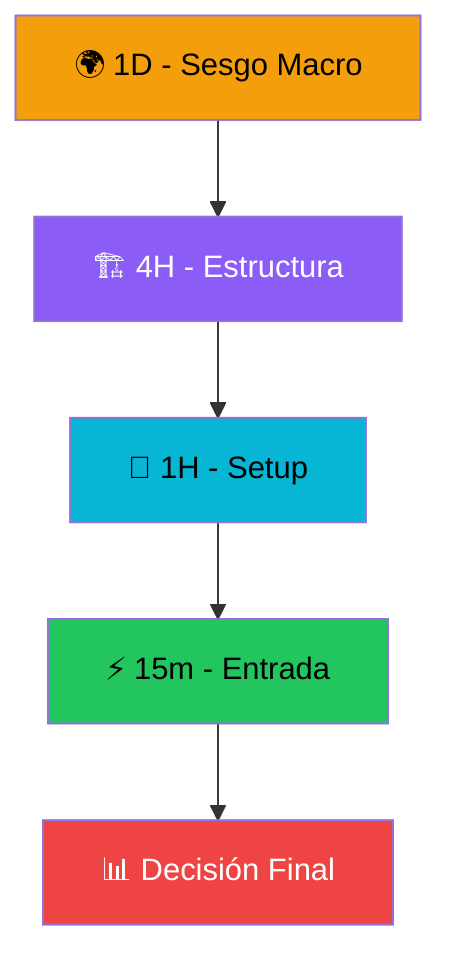
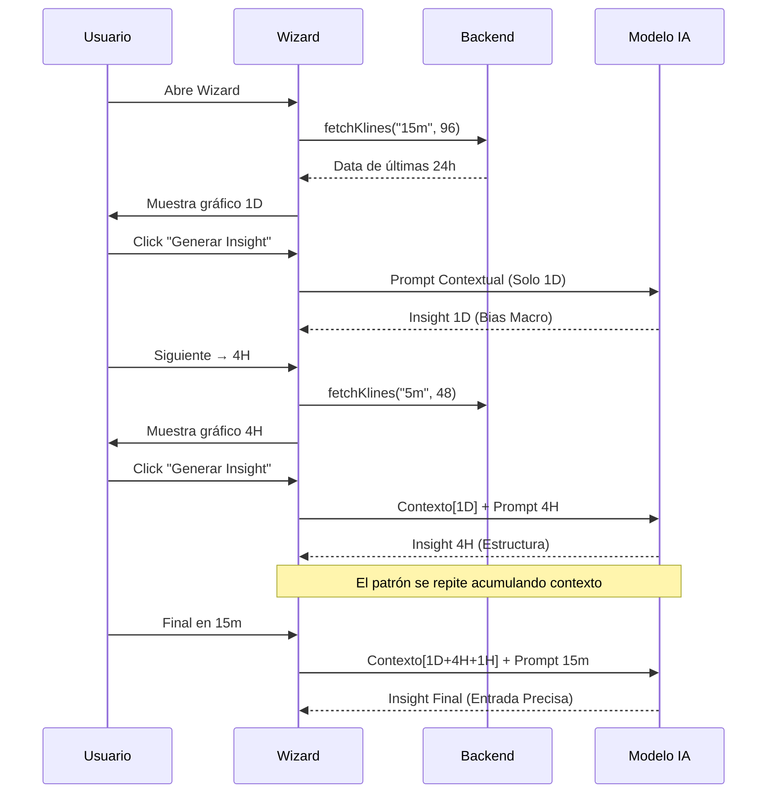

# 🧙‍♂️ Cascade Analysis Wizard - Flujo de Experiencia

## Objetivo

El Cascade Wizard guía al trader a través de un **análisis multi-timeframe descendente** (top-down), imitando el flujo mental de un trader experimentado que analiza desde el panorama macro hasta el punto de entrada óptimo.



## 📦 Estructura de Datos de Salida

Cada paso del wizard genera un objeto JSON estandarizado con la conclusión del análisis. Es fundamental entender estos campos:

### `sentiment_bias` (Sesgo de Sentimiento)

Indica la dirección predominante del mercado según el análisis del timeframe actual. Sirve para filtrar señales contradictorias en pasos posteriores.

* **`LONG`**: Sentimiento Alcista. Se buscan oportunidades de compra. El precio está subiendo o en zona de demanda.
* **`SHORT`**: Sentimiento Bajista. Se buscan oportunidades de venta. El precio está bajando o en zona de oferta.
* **`NEUTRAL`**: Indecisión o Lateralización. No hay una dirección clara. Se recomienda esperar o buscar confirmación extra.

### `mentor_tip` (Consejo del Mentor)

Es la explicación narrativa y el razonamiento detrás del sesgo. Provee el "por qué" de la decisión técnica.

---

## Paso 1: 🌍 Sesgo Macro (Vista 1D)

**Rango**: Últimas 24 horas de acción de precio  
**Velas**: 96 velas de 15 minutos  
**Contexto previo**: Ninguno (es el primer paso)

### ¿Qué se analiza?

- Dirección general del mercado.
* ¿Tendencia alcista, bajista o lateral?
* Momentum predominante.

### Prompt (Ejemplo traducido)

```text
Analiza el timeframe DIARIO (últimas 24h) para determinar el sesgo general del mercado. 
¿Es un mercado en tendencia o en rango? ¿Cuál es la dirección dominante?
```

### Output Esperado

```json
{
  "sentiment_bias": "LONG",
  "mentor_tip": "El mercado muestra un fuerte momentum alcista tras romper la resistencia de los $78,000. Buscamos compras en retrocesos."
}
```

---

## Paso 2: 🏗️ Estructura (Vista 4H)

**Rango**: Últimas 4 horas  
**Velas**: 48 velas de 5 minutos  
**Contexto previo**: Insight de 1D (Sesgo Macro)

### Prompt Matrioshka (Ejemplo traducido)

```markdown
## Contexto de timeframes anteriores:

### Análisis 1D:
- **Sesgo**: LONG
- **Insight**: Mercado con momentum alcista tras romper $78k...

## Ahora analiza 4H:
Analiza el timeframe de 4 HORAS para identificar niveles estructurales clave. 
¿Dónde están las zonas mayores de soporte y resistencia? 
¿Estamos cerca de algún máximo o mínimo significativo?
```

### ¿Qué se analiza?

- Niveles de soporte y resistencia intermedios.
* Estructura de mercado (Altos más altos, Bajos más altos).
* Zonas de liquidez.

### Output Esperado

```json
{
  "sentiment_bias": "LONG",
  "mentor_tip": "Estructura alcista confirmada en temporalidad media. Se ha creado un soporte local en $78,500 que coincide con el FVG (Fair Value Gap) anterior."
}
```

---

## Paso 3: 🎯 Setup (Vista 1H)

**Rango**: Última hora  
**Velas**: 60 velas de 1 minuto  
**Contexto previo**: Insights de 1D + 4H

### Prompt Matrioshka (Ejemplo traducido)

```markdown
## Contexto de timeframes anteriores:

### Análisis 1D:
- **Sesgo**: LONG
- **Insight**: Momentum alcista general...

### Análisis 4H:
- **Sesgo**: LONG
- **Insight**: Estructura alcista, soporte fuerte en $78,500...

## Ahora analiza 1H:
Analiza el timeframe de 1 HORA para buscar configuraciones (setups) de operación. 
¿Se están formando patrones de velas? 
¿Se acerca el precio a un nivel clave donde es probable una reacción?
```

### ¿Qué se analiza?

- Patrones de velas (doji, engulfing, pin bars).
* Aproximación a niveles clave detectados en 4H.
* Setups de entrada potenciales.

### Output Esperado

```json
{
  "sentiment_bias": "LONG",
  "mentor_tip": "Se observa un patrón 'Bullish Engulfing' rebotando justo en el soporte de $78,500 identificado previamente. Setup de compra de alta probabilidad."
}
```

---

## Paso 4: ⚡ Entrada (Vista 15m)

**Rango**: Últimos 15 minutos  
**Velas**: 15 velas de 1 minuto  
**Contexto previo**: Insights de 1D + 4H + 1H (cadena completa)

### Prompt Matrioshka Completo (Ejemplo traducido)

```markdown
## Contexto de timeframes anteriores:

### Análisis 1D:
- **Sesgo**: LONG
- **Insight**: Tendencia general alcista.

### Análisis 4H:
- **Sesgo**: LONG
- **Insight**: Soporte estructural en $78,500 validado.

### Análisis 1H:
- **Sesgo**: LONG
- **Insight**: Patrón de entrada confirmado sobre soporte.

## Ahora analiza 15m:
Analiza el timeframe de 15 MINUTOS para el timing de entrada. 
¿Cuál es la acción de precio inmediata? 
¿Dónde sería el punto de entrada óptimo y el Stop Loss?
```

### ¿Qué se analiza?

- Acción de precio inmediata (micro-estructura).
* Punto de entrada de precisión (Sniper entry).
* Nivel de Stop Loss técnico.
* Ratio Riesgo/Beneficio.

### Output Esperado

```json
{
  "sentiment_bias": "LONG",
  "mentor_tip": "EJECUTAR COMPRA AHORA ($78,600). Colocar Stop Loss en $78,200 (bajo el último swing low). Objetivo (Take Profit) en $81,500. Ratio R:R de 1:7."
}
```

---

## 🔄 Flujo de Datos



---

## 🚀 Beneficios del Enfoque Matrioshka

| Aspecto | Sin Matrioshka (Aislado) | Con Matrioshka (Cascada) |
|---------|----------------|----------------|
| **Contexto** | Cada análisis es una isla aislada. | Cada análisis "sabe" lo que pasó en el nivel superior. |
| **Coherencia** | Posibles contradicciones (1D dice compra, 15m venta sin razón). | Decisiones alineadas (Vendo en 15m *porque* 1D es bajista). |
| **Profundidad** | Análisis superficial de velas. | Razonamiento profundo (Chain-of-thought) a través del tiempo. |
| **Confianza** | Baja. | Alta (múltiples confirmaciones alineadas). |

---

## 🛠️ Estado Actual

* ✅ **UI del Wizard**: Funcional y navegable.
* ✅ **Gráficos**: Muestran rangos de tiempo correctos (ej. 1D muestra 24h reales) y hora local del usuario.
* ✅ **Lógica Matrioshka**: El frontend acumula y envía los insights previos.
* ✅ **Generación de Prompts**: Se construyen dinámicamente con el contexto acumulado.
* 🔲 **Endpoint Dedicado**: Pendiente implementar un endpoint en backend optimizado para estos prompts contextuales (actualmente usa el genérico).
