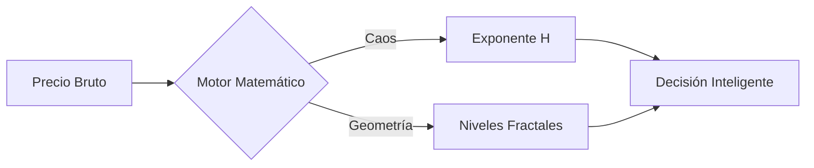
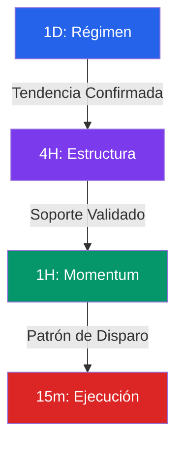
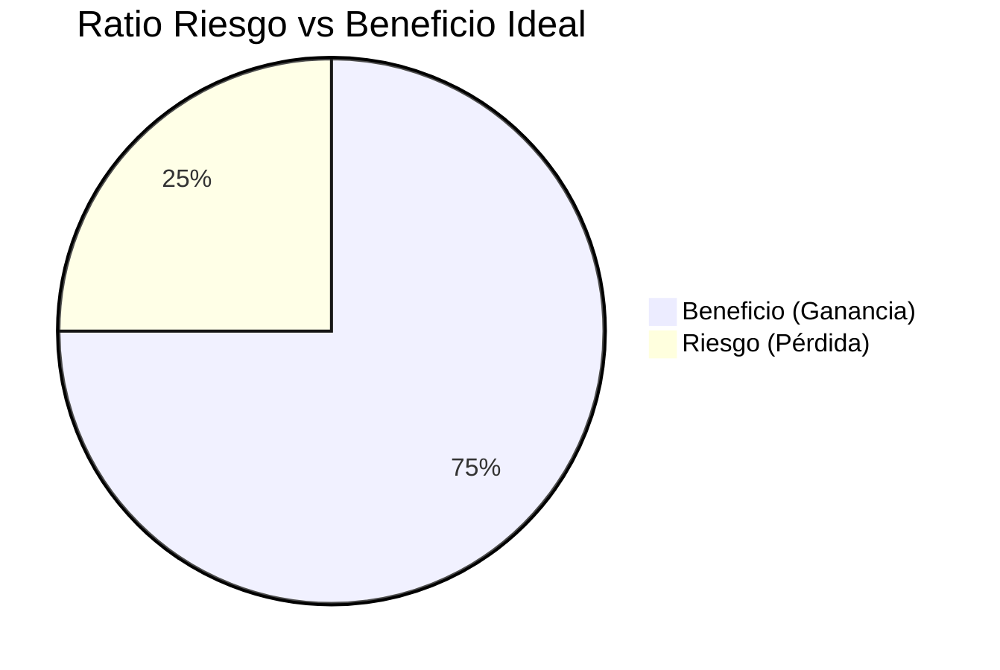

# 📘 Manual de Operativa: Sistema de Inteligencia Fractal

> **Propósito**: Esta guía desglosa la lógica financiera y matemática detrás del **Asistente de Análisis en Cascada**. Está diseñada para el operador que necesita entender no solo _qué_ dice la máquina, sino _por qué_ lo dice.

---

## 1. Filosofía del Sistema: Más allá de lo Visual

Este asistente no "mira" el gráfico como lo hace un humano. Utiliza **Matemáticas Fractales** y **Teoría del Caos** para cuantificar lo que el ojo ignora.

No operamos corazonadas; operamos estadísticas.

El sistema se basa en dos pilares científicos que debes conocer:

1. **El Exponente de Hurst (H)**: Mide la "memoria" del mercado. Nos dice si una tendencia es real o una trampa estadística.
2. **Geometría Fractal**: Identifica niveles de soporte/resistencia exactos donde la liquidez institucional ha dejado huella.

---

## 2. El Proceso de Análisis (La Cascada)

El mercado es fractal: lo que ocurre en un día se repite en 15 minutos. Por eso analizamos en cascada, acumulando probabilidades a nuestro favor en cada paso.

### Paso 1: Filtro de Régimen (Diario 1D) 🌍

Aquí filtramos el ruido. Antes de pensar en comprar o vender, preguntamos: **¿En qué estado está el sistema?**

**La Métrica Clave: El Exponente de Hurst (H)**
El asistente calcula este valor internamente para darte el **Sesgo (Bias)**:

- **Régimen Tendencial (H > 0.6)**: El mercado tiene "memoria". Si subió ayer, es estadísticamente probable que suba hoy.
  - _Estrategia_: **Breakouts**. Compramos rupturas y retrocesos. Ignoramos señales de sobrecompra del RSI.
- **Régimen de Rango/Reversión (H < 0.4)**: El mercado es elástico. Si se aleja de la media, volverá a ella.
  - _Estrategia_: **Swing Trading**. Vendemos alto, compramos bajo.
- **Régimen Aleatorio (H ≈ 0.5)**: Ruido puro (Caminar del Borracho).
  - _Estrategia_: **NO OPERAR**. Aquí es donde la mayoría pierde dinero intentando encontrar patrones donde no existen.

**Tu Acción**: Si el sistema dice "NEUTRAL" o "RUIDO", detente. Si hay tendencia clara, avanza.

---

### Paso 2: Mapa de Liquidez (4 Horas 4H) 🏗️

Ya sabemos _qué_ hacer (comprar/vender), ahora buscamos _dónde_.

**La Herramienta: Fractales y Nodos de Volumen**
No usamos líneas arbitrarias. El sistema detecta **Nodos Fractales**: puntos precisos donde el precio "rebotó" validando una zona de interés institucional.

- **Soporte Estructural**: Un precio que ha sido defendido múltiples veces. El sistema busca la **"Regla de los 3 Toques"**. Un nivel tocado 3 veces es una pared sólida.
- **Fair Value Gaps (FVG)**: Zonas de ineficiencia donde el precio tiende a ser atraído como un imán.

**Tu Acción**: Busca la confluencia. ¿La zona sombreada por el sistema coincide con tu ojo? Si el precio reacciona a una zona matemática, la probabilidad de éxito se dispara.

---

### Paso 3: Confirmación de Momentum (1 Hora 1H) 🎯

Tenemos la dirección (1D) y el lugar (4H). Ahora necesitamos la **Señal**.

**La Herramienta: Divergencias RSI**
El sistema compara la velocidad del precio (Momentum) con el precio mismo.

- **Divergencia Regular**: El precio hace un nuevo máximo, pero el oscilador (RSI) no. Indica agotamiento. (Señal de Reversión).
- **Divergencia Oculta**: El precio retrocede, pero el oscilador se enfría desproporcionadamente. Es la señal más potente de continuación de tendencia.

**Tu Acción**: Buscar el patrón de disparo. Banderas, Cuñas o Triángulos que coincidan con la lectura del momentum.

---

### Paso 4: Ejecución Quirúrgica (15 Minutos 15m) ⚡

Aquí aplicamos la gestión de riesgo matemática. Es el paso más importante para proteger tu capital.

**La Métrica Clave: ATR (Average True Range)**
El sistema usa la volatilidad real del mercado para calcular tus niveles de salida. No usamos stops fijos o arbitrarios.

- **Cálculo del Stop Loss (SL)**: `Precio de Entrada +/- (2 * ATR)`.
  - _Por qué_: Esto coloca tu salida de emergencia fuera del "ruido" normal del mercado. Si el precio toca tu SL, no fue mala suerte; la tesis se invalidó estructuralmente.
- **Ratio Riesgo/Beneficio (R:R)**: El sistema divide la distancia al objetivo por la distancia al riesgo.
  - _Regla Inquebrantable_: Si el resultado es **menor a 2.0**, el sistema te aconsejará **DESCARTAR LA OPERACIÓN**. Matemáticamente, no vale la pena.

**Tu Acción Final**: Revisa los números. ¿Estás dispuesto a arriesgar 1 unidad para ganar 3? Si la respuesta es sí, ejecuta la orden.

---

## Resumen de la Lógica

| Paso    | Pregunta Financiera                           | Herramienta Matemática                 |
| :------ | :-------------------------------------------- | :------------------------------------- |
| **1D**  | ¿Existe una oportunidad estadística?          | Exponente de Hurst + Teoría del Caos   |
| **4H**  | ¿Dónde está la liquidez institucional?        | Fractales de Williams + Order Blocks   |
| **1H**  | ¿Se está agotando o acelerando el movimiento? | RSI + Divergencias de Momentum         |
| **15m** | ¿La recompensa justifica el riesgo?           | Volatilidad ATR + Esperanza Matemática |

Si sigues estos pasos, no estás apostando. Estás ejecutando un plan de negocio basado en probabilidades.
