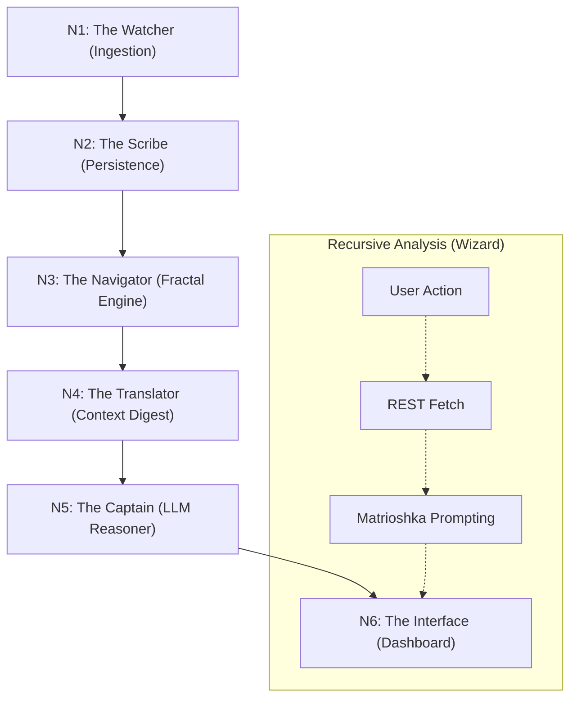

# Flow Map: Sequential Trading Logic (Fractal Enhanced)

This map defines the strictly sequential steps of the Trading Bot Flow, mapping the journey from raw market noise to sovereign financial wisdom.

## 🗺️ The Sequential Chain

---

## 🔍 Node Zoom-In & Decisions

### N1: The Watcher (El Vigía) - Data Ingestion

* **Description**: The eyes of the ship. Continuous, real-time capture of the market's heartbeat.
* **Requirement**: Low-latency connection, Automatic Reconnection, Binance Public API access.
* **Stack**: Node.js, `ws` (WebSocket) connecting to `wss://stream.binance.com:9443`.
* **Key Logic**:
  * Maintains a "Heartbeat" connection.
  * Filters incoming JSON payloads for `kline_1m` events.
* **Decisions**:
  * **WebSocket vs Polling**: Chosen WebSocket for zero-latency capture of volatility spikes (crucial for Fractal analysis).
  * **Direct Raw Stream**: Storing raw event data temporarily to allow for potential "Tick" replaying later.
* **Output**: Stream of raw `Candle` objects.

### N2: The Scribe (El Escriba) - Time Architect

* **Description**: The memory of the ship. Groups ticks and writes history to the logbook.
* **Requirement**: Persistent local storage, Time-synchronization logic, ACID compliance.
* **Stack**: `better-sqlite3` connecting to `data/trading.db`.
* **Key Logic**:
  * **Upsert Strategy**: Ensures that incomplete 1m candles are updated in real-time until the "Closed" flag is received.
  * **Indexing**: `timestamp` index for fast retrieval of the last 500 candles (needed for Hurst).
* **Decisions**:
  * **Isolation**: Used a dedicated `trading.db` instead of the main `flow.db` to prevent locking issues and allow for portable "Trading Brain" backups.
  * **SQLite WAL Mode**: Enabled for high-concurrency writes/reads.
* **Output**: Persisted `Candle` rows. Trigger for N3.

### N3: The Navigator (El Oficial) - Fractal State Machine

* **Description**: The brain of the operation. Before moving, it checks the weather (Regime) and the map (Nodes).
* **Requirement**: Mathematical precision, Access to historical context (N-500).
* **Stack**: Custom `FractalMath` service + `technicalindicators` library.
* **Logic Flow (The "Filter"):**
    1. **Fetch History**: Pulls last 500 closed candles from `trading.db`.
    2. **Calculate Hurst ($H$)**:
        * If $H < 0.4$: Set `Regime = MEAN_REVERSION`. Abort Trend logic.
        * If $H > 0.6$: Set `Regime = TRENDING`. Abort Oscillator logic.
        * Else: `Regime = NOISE`. **STOP**.
    3. **Map Terrain**: Identify 5-bar Fractal Highs/Lows. Store as `ActiveNodes`.
    4. **Confirm Signals**: Run RSI/MACD only if allowed by Regime.
* **Decisions**:
  * **Regime First**: We prioritize the "Physics" of the market (Hurst) before the "Signal". This prevents the common failure of bot strategies in ranging markets.
  * **Local Calculation**: Math performed in Node.js (not Python) to keep the stack unified and snappy.
* **Output**: `MarketState` object (Regime + Active Nodes + Valid Signals).

### N4: The Translator (El Traductor) - Context Digest

* **Description**: Bureaucracy management. Prepares the report for the Captain.
* **Requirement**: Concise formatting, signal noise reduction.
* **Stack**: TypeScript Interfaces & Template Strings.
* **Key Logic**:
  * Converts `MarketState` into a concise JSON/Markdown block.
  * **Noise Reduction**: If `Regime == NOISE`, it produces a specific "Stand Down" prompt.
* **Output**: `PromptContext` payload.

### N5: The Captain (El Capitán) - Tiered Intelligence

* **Description**: The ultimate decision maker.
* **Requirement**: Contextual reasoning, natural language explanation.
* **Stack**: Gemini Flash 1.5 (High Speed/Low Cost) or Groq Llama 3.
* **Key Logic**:
  * Receives `PromptContext`.
  * References `knowledge/combined-synthesis.md` (System Prompt) to interpret the data.
  * **Reasoning**: "Given H=0.75, I ignore the RSI Overbought signal and focus on the Daily Node breakout."
* **Decisions**:
  * **Tiered AI**: Using smaller/faster models (Flash/Groq) for the minute-by-minute loop to manage costs and latency (~2s), reserving heavy models (GPT-4) for Weekly analysis.
  * **Probabilistic Forecasting**: Intead of "Buy Now", the output is a "Confidence Score" and "Rationale".
* **Output**: `AdvisorNote` (Markdown + Sentinel Status).

### N6: The Interface - Insight Distribution

* **Description**: The bridge to the user.
* **Requirement**: Reactive UI updates, visual confirmation of hidden data (Nodes).
* **Stack**: Svelte 5 Stores + Chart.js.
* **UI Logic**:
  * **Reactive**: Updates instantly when N5 returns.
  * **Visuals**: Plots Fractal Nodes as horizontal zones on the chart.
  * **Regime Indicator**: A "Weather Widget" showing the current Hurst status (Sunny/Stormy).
* **Output**: Visual updates on the dashboard.

---

### W: The Cascade Wizard (El Sabio) - On-Demand Analysis

* **Description**: A manual, deep-dive tool that mimics a human trader's "Top-Down" analysis workflow. Unlike the automatic stream, this is user-initiated.
* **Flow**: 1D (Macro) → 4H (Structure) → 1H (Setup) → 15m (Trigger).
* **Key Logic**: **Matrioshka Prompting**. The insight from the previous timeframe is passed as context to the next prompt, creating a coherent narrative chain.
* **Integration**: bypassing the WebSocket stream, it fetches historical data via REST API on demand.

---

## ⚙️ Technical Execution Narrative

How a single "Heartbeat" travels through the system:

1. **Initialization**:
    * The `TradingService` boots up. It initializes the `SQLite` connection to `trading.db` and verifies the schema (N2).
    * It instantiates the `BinanceStream` class (N1), which opens a secure WebSocket to the exchange.

2. **The Event Loop (Per Minute)**:
    * **T=00s**: A Binance socket event arrives: "Candle Closed".
    * **N1 -> N2**: The watcher emits an internal event `CANDLE_CLOSED`. The Scribe immediately commits this finalizes candle to `trading.db`.
    * **N3 Trigger**: The persistence of a closed candle triggers `Analyst.analyze()`.
    * **Calculation**:
        * N3 queries `SELECT * FROM candles ORDER BY time DESC LIMIT 500`.
        * It computes the Hurst Exponent on the Log Returns of this array.
        * **Fork**: If `H=0.5` (Noise), it emits `ANALYSIS_COMPLETE` with status `WAIT`.
        * If `H=0.7` (Trend), it proceeds to identify if the current price is near a cached `FractalNode`.
    * **N4 Preparation**: The `Synthesizer` takes the complex N3 object and formats a prompt: *"Market is Trending (H=0.7). Price (98k) is testing Daily Fractal Resistance (98.2k)."*
    * **N5 Intelligence**: The system sends this prompt to the LLM via `LLMService`.
        * The LLM replies: *"bullish bias. Wait for H1 candle close above 98.2k to confirm breakout. Ignore divergence."*
    * **N6 Update**: The frontend `AdvisorStore` receives the new note. The UI flashes a notification, updates the "Regime" icon to 'Trending', and draws a yellow line at 98.2k on the chart.

This entire cycle happens typically within **2-5 seconds** of the candle close.
