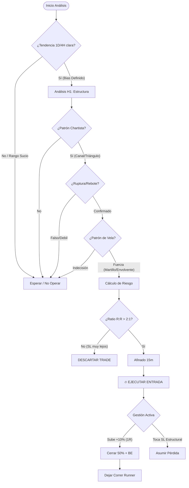

# Estrategia Manual de Trading & Análisis de Brechas

Este documento captura el flujo de trabajo manual del usuario, su formalización técnica y el análisis de cómo el **Insight Agent** evoluciona para soportar este proceso.

---

## 1. La Fuente: Narrativa del Usuario 👤

*Relato directo del trader sobre su operativa manual.*

**Capital Inicial**: 100 USDT (Futuros Binance).

### El Flujo de Análisis

1. **Macro (1D)**: Revisa Soportes, Resistencias, Patrones Chartistas (triángulos, canales) y de Vela (martillos).
2. **Intermedio (4H)**: Confirma la estructura detectada en diario.
3. **Decisión (1H)**: **Punto Crítico**.
    * Valida **Soportes/Resistencias con 3 toques** (fuerza).
    * Busca **Canales Dinámicos** y rupturas.
    * **Gatillo**: Ruptura de patrón chartista con patrón de vela confirmatorio.
4. **Afinado (15m)**: Busca el timing preciso (pullback dentro de la vela de 1H) para entrar barato.

### La Gestión (Filosofía)

* **Entrada**: Ejecuta la posición (Long/Short).
* **Stop Loss (SL)**: *Dinámico en estructura, pero validado matemáticamente.*
* **Gestión Activa**:
  * Al llegar al **+10% de ganancia** (o ratio 1:1), cierra el **50%** de la posición.
  * Mueve el SL a Break Even (o zona segura).
  * Deja correr el resto (**Runner**) sin Take Profit fijo.
* **Regla de Oro (Matemática)**: No importa el monto del dinero, importa el porcentaje y las matemáticas del **Ratio Riesgo/Beneficio**.
  * *"Si tengo un SL del 50% y gano 20%, necesito 3 operaciones positivas para recuperar. No tiene sentido."*
  * Solo toma operaciones donde la ganancia potencial justifica sobradamente el riesgo estructural.

---

## 2. El Árbol de Decisiones (Decision Tree) 🌳

Visualización del proceso mental para filtrar y ejecutar una operación.

---

## 3. El Espejo Técnico (Formalización) 🎓

**Estrategia**: *Multi-Timeframe Trend Following with Structural Confluence*

### Principios Clave

1. **Top-Down Analysis**: Filtrar ruido operando solo en dirección de la temporalidad superior (1D bias).
2. **Structural Invalidation**: El Stop Loss se coloca donde la tesis de inversión falla (bajo el último mínimo), no en un % arbitrario.
3. **R:R Asymmetry**: El filtro final es matemático. Si `(Target / Riesgo) < 2`, la operación se descarta aunque el gráfico sea "bonito".
4. **Free-Roll Psychology**: Al tomar beneficios parciales (50%) en 1R, se elimina el estrés emocional, permitiendo capturar tendencias largas (*Home Runs*).

---

## 4. Análisis de Brechas (Gap Analysis) 🔍

¿Qué le falta al **Insight Agent (Actual)** para pensar como el Usuario?

| Característica | Usuario (Manual) | App (Actual) | Brecha (Gap) |
| :--- | :--- | :--- | :--- |
| **Estructura** | Canales Dinámicos, Triángulos, Banderas. | Fractales Horizontales (Soporte/Resistencia). | **Alta**. El bot es ciego a la geometría diagonal. |
| **Validación** | "Regla de los 3 Toques" (fuerza por repetición). | Detecta presencia de nivel, no persistencia. | **Media**. Necesita contar rebotes históricos. |
| **Gatillo** | Patrones de Vela (Martillo, Envolvente). | Precios de Cierre y Hurst. | **Alta**. No analiza la forma OHLC de la vela. |
| **Gestión** | SL Estructural + Ratio R:R Matemático. | Consejos genéricos de "Support levels". | **Alta**. No calcula riesgo ni sugiere SL. |
| **Flujo** | Análisis en Cascada (1D -> 1H -> 15m). | Análisis "Snapshot" del momento actual. | **Media**. El bot analiza una ventana de 500 velas, pero no "narra" la cascada. |

---

## 5. Roadmap: Propuesta "Insight en Cascada" (Deep Context) 🚀

Para cerrar la brecha, proponemos evolucionar el agente a un sistema de **Análisis Secuencial (Chain of Thought)**, simulando el proceso mental del usuario.

### Nueva Arquitectura del Prompt (V3)

El Backend orquestará 3 llamadas o pasos de razonamiento lógico antes de dar la respuesta final.

#### Paso 1: El Climatólogo (Contexto 1D/4H) 🌤️

* **Misión**: Definir el Bias.
* **Input**: Velas Diarias + EMA 200.
* **Output**: "Tendencia Alcista Secular. Buscamos Longs."

#### Paso 2: El Arquitecto (Decisión 1H) 🏗️

* **Misión**: Encontrar el Setup.
* **Input**: Bias (Paso 1) + Fractales H1 + "Contador de Toques".
* **Output**: "Zona de interés en 99k. Resistencia tocada 3 veces. Ruptura inminente."

#### Paso 3: El Estratega (Riesgo y Ejecución) 🛡️

* **Misión**: Validar las Matemáticas.
* **Input**: Setup (Paso 2) + Volatilidad (ATR).
* **Output Final**:
  * **Señal**: "Posible LONG por ruptura de 99k."
  * **Stop Loss Sugerido**: "97.5k (Bajo última estructura)."
  * **Ratio Estimado**: "3.5:1 (Excelente)."

### Mejoras Inmediatas Propuestas

1. **Detección de Velas**: Añadir biblioteca técnica para identificar `Hammer`, `Doji`, `Engulfing`.
2. **Contador de Toques**: Algoritmo simple que cuente cuántas veces el precio rebotó en un rango del 0.5% de un fractal.
3. **Prompt V3**: Actualizar `SynthesizerService` para incluir métricas de EMAs y sugerencia de SL basada en ATR/Fractales.
