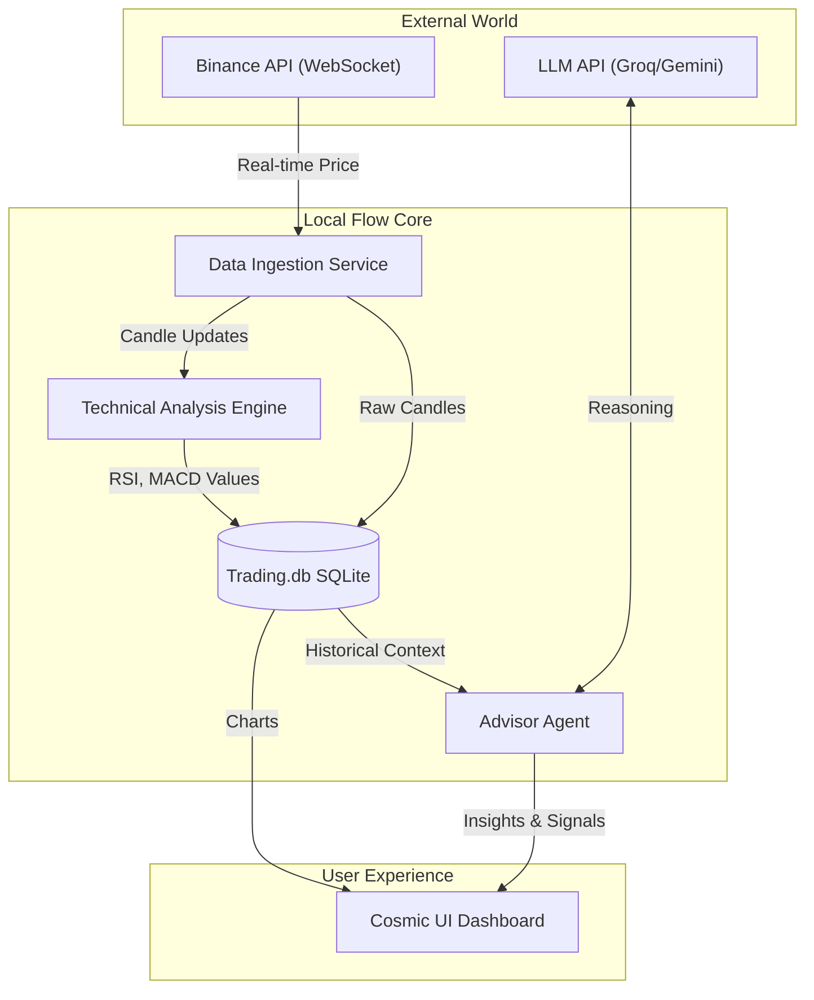

# Technical Feasibility & Architecture Report: Trading Bot Flow

This document details the technical implementation, technology stack, and architectural decisions for the Trading Bot Flow.

## 1. High-Level Architecture Diagram

## 2. Technology Stack Selection

### Data Layer

* **Source**: Binance Public Data Stream (WebSocket).
  * *Pros*: Zero latency, no API limits for public streams, efficient pushes.
  * *Cons*: Connection management (needs reconnection logic).
* **Persistence**: SQLite (Separate instance: `trading.db`).
  * *Strategy*: Store OHLCV (Open, High, Low, Close, Volume) candles.
  * *Granularity*: 1-second ticks aggregated into 1-minute candles for storage efficiency.

### Analysis Layer ("The Hard Math")

* **Library**: `technicalindicators` (Node.js).
* **Role**: Calculate metrics deterministically. LLMs are bad at math; code is perfect at it.
* **Metrics**: RSI (Relative Strength Index), MACD, EMA (Exponential Moving Averages), Bollinger Bands.

### Intelligence Layer ("The Soft Wisdom")

* **Strategy**: Tiered Multi-Agent Approach.
  * **Tier 1 (Execution/Alerts)**: Pure Code. "IF RSI > 70 THEN Alert". Zero cost.
  * **Tier 2 (Tactical Feedback)**: **Groq (Llama 3)** or **Gemini Flash**.
    * *Freq*: Every 15-60 mins.
    * *Task*: "Review the last hour of market structure. Summarize trend strength."
    * *Cost*: Extremely low (~$0.10/million tokens).
  * **Tier 3 (Strategic Mentor)**: **GPT-4o** or **Claude 3.5 Sonnet**.
    * *Freq*: Daily / On-Demand.
    * *Task*: "Deep dive analysis of the day's performance and educational feedback."
    * *Cost*: Higher, but used sparingly.

## 3. Cost Analysis (Monthly Estimates)

| Component | Service | Est. Usage | Cost |
| :--- | :--- | :--- | :--- |
| **Market Data** | Binance WS | Continuous | **$0.00** |
| **Hosting** | Local Machine | N/A | **$0.00** |
| **LLM (Tier 2)** | Gemini Flash | 1M input tokens/day | **~$2.00** |
| **LLM (Tier 3)** | GPT-4o / Claude | 50k tokens/day | **~$10.00** |
| **Total** | | | **~$12.00/mo** |

*Note: Costs scale with frequency of LLM calls. The "Paper Trading" POC will be effectively free if using local models (Ollama) or lower tiers.*

## 4. Implementation Stages

### Phase 1: The Observer (POC)

* [ ] Connect to Binance WebSocket.
* [ ] Create `trading.db` schema.
* [ ] Ingest live price data into SQLite.
* [ ] Simple UI chart showing live price.

### Phase 2: The Analyst

* [ ] Integrate `technicalindicators` library.
* [ ] Compute RSI and MA in real-time.
* [ ] Visualize indicators on the dashboard.

### Phase 3: The Advisor

* [ ] Design the "Context Window" (how much data to send the LLM).
* [ ] Connect a basic LLM agent (Gemini Flash).
* [ ] Display text-based insights alongside the chart.
